# limel-button

<!-- Auto Generated Below -->

## Properties

| Property   | Attribute  | Description                                                                                                                                                                                                                                 | Type      | Default     |
| ---------- | ---------- | ------------------------------------------------------------------------------------------------------------------------------------------------------------------------------------------------------------------------------------------- | --------- | ----------- |
| `disabled` | `disabled` | Set to `true` to disable the button. Defaults to `false`.                                                                                                                                                                                   | `boolean` | `false`     |
| `icon`     | `icon`     | Set icon for the button                                                                                                                                                                                                                     | `string`  | `undefined` |
| `label`    | `label`    | The text to show on the button.                                                                                                                                                                                                             | `string`  | `undefined` |
| `loading`  | `loading`  | Set to `true` to put the button in the `loading` state. Please note that this does _not_ disable the button. If the button should be disabled while loading, the `disabled` property should be set to `true` as well.  Defaults to `false`. | `boolean` | `false`     |
| `outlined` | `outlined` | Set to `true` to make the button outlined. Defaults to `false`.                                                                                                                                                                             | `boolean` | `false`     |
| `primary`  | `primary`  | Set to `true` to make the button primary. Defaults to `false`.                                                                                                                                                                              | `boolean` | `false`     |

## Dependencies

### Used by

 - [limel-example-banner](../../examples/banner)
 - [limel-example-button](../../examples/button)
 - [limel-example-button-click](../../examples/button)
 - [limel-example-checkbox](../../examples/checkbox)
 - [limel-example-collapsible-section](../../examples/collapsible-section)
 - [limel-example-color](../../examples/color)
 - [limel-example-date-picker-programmatic-change](../../examples/date-picker)
 - [limel-example-dialog](../../examples/dialog)
 - [limel-example-dialog-closing-actions](../../examples/dialog)
 - [limel-example-dialog-form](../../examples/dialog)
 - [limel-example-dialog-fullscreen](../../examples/dialog)
 - [limel-example-dialog-heading](../../examples/dialog)
 - [limel-example-dialog-size](../../examples/dialog)
 - [limel-example-icon-button](../../examples/icon-button)
 - [limel-example-icon-button-toggle-state](../../examples/icon-button)
 - [limel-example-input-field-autocomplete](../../examples/input-field)
 - [limel-example-input-field-number](../../examples/input-field)
 - [limel-example-input-field-text](../../examples/input-field)
 - [limel-example-menu](../../examples/menu)
 - [limel-example-select](../../examples/select)
 - [limel-example-select-change-options](../../examples/select)
 - [limel-example-select-dialog](../../examples/select)
 - [limel-example-slider](../../examples/slider)
 - [limel-example-snackbar](../../examples/snackbar)
 - [limel-example-switch](../../examples/switch)

### Depends on

- [limel-spinner](../spinner)
- [limel-icon](../icon)

### Graph

```mermaid
graph TD;
  limel-button --> limel-spinner
  limel-button --> limel-icon
  limel-example-banner --> limel-button
  limel-example-button --> limel-button
  limel-example-button-click --> limel-button
  limel-example-checkbox --> limel-button
  limel-example-collapsible-section --> limel-button
  limel-example-color --> limel-button
  limel-example-date-picker-programmatic-change --> limel-button
  limel-example-dialog --> limel-button
  limel-example-dialog-closing-actions --> limel-button
  limel-example-dialog-form --> limel-button
  limel-example-dialog-fullscreen --> limel-button
  limel-example-dialog-heading --> limel-button
  limel-example-dialog-size --> limel-button
  limel-example-icon-button --> limel-button
  limel-example-icon-button-toggle-state --> limel-button
  limel-example-input-field-autocomplete --> limel-button
  limel-example-input-field-number --> limel-button
  limel-example-input-field-text --> limel-button
  limel-example-menu --> limel-button
  limel-example-select --> limel-button
  limel-example-select-change-options --> limel-button
  limel-example-select-dialog --> limel-button
  limel-example-slider --> limel-button
  limel-example-snackbar --> limel-button
  limel-example-switch --> limel-button
  style limel-button fill:#f9f,stroke:#333,stroke-width:4px
```

----------------------------------------------

*Built with [StencilJS](https://stenciljs.com/)*
