# limel-checkbox

<!-- Auto Generated Below -->

## Properties

| Property   | Attribute  | Description                                                            | Type      | Default     |
| ---------- | ---------- | ---------------------------------------------------------------------- | --------- | ----------- |
| `checked`  | `checked`  | The value of the checkbox. Set to `true` to make the checkbox checked. | `boolean` | `false`     |
| `disabled` | `disabled` | Disables the input field when `true`.                                  | `boolean` | `false`     |
| `label`    | `label`    | The checkbox label.                                                    | `string`  | `undefined` |

## Events

| Event    | Description                              | Type                   |
| -------- | ---------------------------------------- | ---------------------- |
| `change` | Emitted when the input value is changed. | `CustomEvent<boolean>` |

## Dependencies

### Used by

 - [limel-example-checkbox](../../examples/checkbox)
 - [limel-example-chip-set](../../examples/chip-set)
 - [limel-example-chip-set-choice](../../examples/chip-set)
 - [limel-example-chip-set-filter](../../examples/chip-set)
 - [limel-example-chip-set-input](../../examples/chip-set)
 - [limel-example-dialog-heading](../../examples/dialog)
 - [limel-example-flex-container](../../examples/flex-container)
 - [limel-example-picker](../../examples/picker)
 - [limel-example-picker-empty-suggestions](../../examples/picker)
 - [limel-example-picker-icons](../../examples/picker)
 - [limel-example-picker-multiple](../../examples/picker)
 - [limel-example-select-multiple](../../examples/select)
 - [limel-example-snackbar](../../examples/snackbar)

### Graph

```mermaid
graph TD;
  limel-example-checkbox --> limel-checkbox
  limel-example-chip-set --> limel-checkbox
  limel-example-chip-set-choice --> limel-checkbox
  limel-example-chip-set-filter --> limel-checkbox
  limel-example-chip-set-input --> limel-checkbox
  limel-example-dialog-heading --> limel-checkbox
  limel-example-flex-container --> limel-checkbox
  limel-example-picker --> limel-checkbox
  limel-example-picker-empty-suggestions --> limel-checkbox
  limel-example-picker-icons --> limel-checkbox
  limel-example-picker-multiple --> limel-checkbox
  limel-example-select-multiple --> limel-checkbox
  limel-example-snackbar --> limel-checkbox
  style limel-checkbox fill:#f9f,stroke:#333,stroke-width:4px
```

----------------------------------------------

*Built with [StencilJS](https://stenciljs.com/)*
