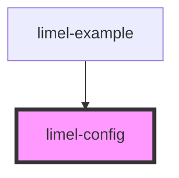

# limel-config

<!-- Auto Generated Below -->

## Properties

| Property | Attribute | Description | Type     | Default     |
| -------- | --------- | ----------- | -------- | ----------- |
| `config` | --        |             | `object` | `undefined` |

## Dependencies

### Used by

 - [limel-example](../../examples)

### Graph

----------------------------------------------

*Built with [StencilJS](https://stenciljs.com/)*
