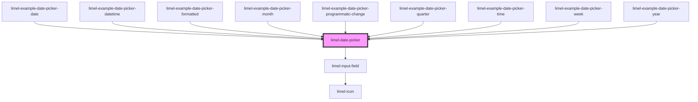

# limel-date-picker

<!-- Auto Generated Below -->

## Properties

| Property   | Attribute  | Description                                                                                                            | Type                                                                         | Default      |
| ---------- | ---------- | ---------------------------------------------------------------------------------------------------------------------- | ---------------------------------------------------------------------------- | ------------ |
| `disabled` | `disabled` | Disables the date picker when `true`. Defaults to `false`.                                                             | `boolean`                                                                    | `undefined`  |
| `format`   | `format`   | Format to display the selected date in                                                                                 | `string`                                                                     | `undefined`  |
| `invalid`  | `invalid`  | Set to `true` to indicate that the current value of the date picker is invalid. Defaults to `false`.                   | `boolean`                                                                    | `undefined`  |
| `label`    | `label`    | Text to display next to the date picker                                                                                | `string`                                                                     | `undefined`  |
| `language` | `language` | Defines the localisation for translations and date formatting. Property `format` customizes the localized date format. | `"da" \| "en" \| "fi" \| "no" \| "sv"`                                       | `'en'`       |
| `required` | `required` | Set to `true` to indicate that the field is required. Defaults to `false`.                                             | `boolean`                                                                    | `undefined`  |
| `type`     | `type`     | Type of date picker. Defaults to `datetime`                                                                            | `"date" \| "datetime" \| "month" \| "quarter" \| "time" \| "week" \| "year"` | `'datetime'` |
| `value`    | --         | The value of the field.                                                                                                | `Date`                                                                       | `undefined`  |

## Events

| Event    | Description                                    | Type                |
| -------- | ---------------------------------------------- | ------------------- |
| `change` | Emitted when the date picker value is changed. | `CustomEvent<Date>` |

## Dependencies

### Used by

 - [limel-example-date-picker-date](../../examples/date-picker)
 - [limel-example-date-picker-datetime](../../examples/date-picker)
 - [limel-example-date-picker-formatted](../../examples/date-picker)
 - [limel-example-date-picker-month](../../examples/date-picker)
 - [limel-example-date-picker-programmatic-change](../../examples/date-picker)
 - [limel-example-date-picker-quarter](../../examples/date-picker)
 - [limel-example-date-picker-time](../../examples/date-picker)
 - [limel-example-date-picker-week](../../examples/date-picker)
 - [limel-example-date-picker-year](../../examples/date-picker)

### Depends on

- [limel-input-field](../input-field)

### Graph

----------------------------------------------

*Built with [StencilJS](https://stenciljs.com/)*
