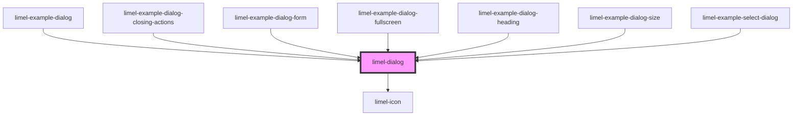

# limel-dialog

<!-- Auto Generated Below -->

## Properties

| Property         | Attribute    | Description                                                           | Type                                           | Default                                                      |
| ---------------- | ------------ | --------------------------------------------------------------------- | ---------------------------------------------- | ------------------------------------------------------------ |
| `closingActions` | --           | Defines which action triggers a close-event.                          | `{ escapeKey: boolean; scrimClick: boolean; }` | `{         escapeKey: true,         scrimClick: true,     }` |
| `fullscreen`     | `fullscreen` | Set to `true` to make the dialog "fullscreen".                        | `boolean`                                      | `false`                                                      |
| `heading`        | `heading`    | The heading for the dialog, if any.                                   | `DialogHeading \| string`                      | `undefined`                                                  |
| `open`           | `open`       | `true` if the dialog is open, `false` otherwise. Defaults to `false`. | `boolean`                                      | `false`                                                      |

## Events

| Event     | Description                                                                                                                         | Type                |
| --------- | ----------------------------------------------------------------------------------------------------------------------------------- | ------------------- |
| `close`   | Emitted when the dialog is closed from inside the component. (*Not* emitted when the consumer sets the `open`-property to `false`.) | `CustomEvent<void>` |
| `closing` | Emitted when the dialog is in the process of being closed.                                                                          | `CustomEvent<void>` |

## CSS Custom Properties

| Name                                     | Description                                             |
| ---------------------------------------- | ------------------------------------------------------- |
| `--dialog-heading-icon-background-color` | Background color of the icon when displayed as a badge. |
| `--dialog-heading-icon-color`            | Color of the icon.                                      |
| `--dialog-heading-subtitle-color`        | Color of the subtitle.                                  |
| `--dialog-heading-supporting-text-color` | Color of the supporting text.                           |
| `--dialog-heading-title-color`           | Color of the title.                                     |
| `--dialog-height`                        | Height of the dialog.                                   |
| `--dialog-width`                         | Width of the dialog.                                    |

## Dependencies

### Used by

 - [limel-example-dialog](../../examples/dialog)
 - [limel-example-dialog-closing-actions](../../examples/dialog)
 - [limel-example-dialog-form](../../examples/dialog)
 - [limel-example-dialog-fullscreen](../../examples/dialog)
 - [limel-example-dialog-heading](../../examples/dialog)
 - [limel-example-dialog-size](../../examples/dialog)
 - [limel-example-select-dialog](../../examples/select)

### Depends on

- [limel-icon](../icon)

### Graph

----------------------------------------------

*Built with [StencilJS](https://stenciljs.com/)*
