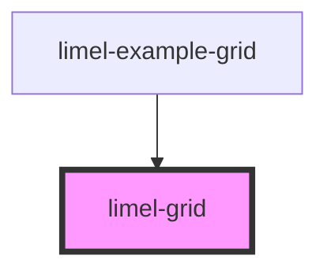

# limel-grid

<!-- Auto Generated Below -->

## CSS Custom Properties

| Name                      | Description                                         |
| ------------------------- | --------------------------------------------------- |
| `--lime-grid-area`        | Grid layout                                         |
| `--lime-grid-cell-height` | Height of grid cells, defaults to 150 pixels        |
| `--lime-grid-cell-width`  | Minimum width of grid cells, defaults to 150 pixels |
| `--lime-grid-columns`     | Number of columns in the grid, defaults to 8        |

## Dependencies

### Used by

 - [limel-example-grid](../../examples/grid)

### Graph

----------------------------------------------

*Built with [StencilJS](https://stenciljs.com/)*
