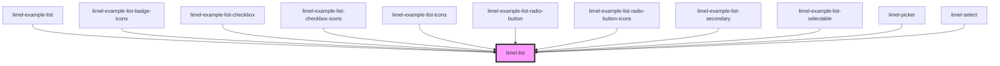

# limel-list

<!-- Auto Generated Below -->

## Properties

| Property     | Attribute     | Description                                                                                                                                                                                                                   | Type                                          | Default     |
| ------------ | ------------- | ----------------------------------------------------------------------------------------------------------------------------------------------------------------------------------------------------------------------------- | --------------------------------------------- | ----------- |
| `badgeIcons` | `badge-icons` | Set to `true` if the list should display larger icons with a background                                                                                                                                                       | `boolean`                                     | `undefined` |
| `iconSize`   | `icon-size`   | Size of the icons in the list                                                                                                                                                                                                 | `"large" \| "medium" \| "small" \| "x-small"` | `'small'`   |
| `items`      | --            | List of items to display                                                                                                                                                                                                      | `(ListItem<any> \| ListSeparator)[]`          | `undefined` |
| `type`       | `type`        | The type of the list, omit to get a regular list. Available types are: `selectable`: regular list with single selection. `radio`: radio button list with single selection. `checkbox`: checkbox list with multiple selection. | `"checkbox" \| "radio" \| "selectable"`       | `undefined` |

## Events

| Event    | Description                                                                                     | Type                                            |
| -------- | ----------------------------------------------------------------------------------------------- | ----------------------------------------------- |
| `change` | Fired when a new value has been selected from the list. Only fired if selectable is set to true | `CustomEvent<ListItem<any> \| ListItem<any>[]>` |

## CSS Custom Properties

| Name                      | Description                                                                                                |
| ------------------------- | ---------------------------------------------------------------------------------------------------------- |
| `--icon-background-color` | Color to use for icon background when `badgeIcons=true`.                                                   |
| `--icon-color`            | Color to use for icon. Defaults to grey when `badgeIcons=false`. Defaults to white when `badgeIcons=true`. |

## Dependencies

### Used by

 - [limel-example-list](../../examples/list)
 - [limel-example-list-badge-icons](../../examples/list)
 - [limel-example-list-checkbox](../../examples/list)
 - [limel-example-list-checkbox-icons](../../examples/list)
 - [limel-example-list-icons](../../examples/list)
 - [limel-example-list-radio-button](../../examples/list)
 - [limel-example-list-radio-button-icons](../../examples/list)
 - [limel-example-list-secondary](../../examples/list)
 - [limel-example-list-selectable](../../examples/list)
 - [limel-picker](../picker)
 - [limel-select](../select)

### Graph

----------------------------------------------

*Built with [StencilJS](https://stenciljs.com/)*
