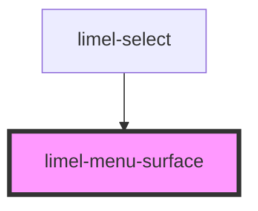

# limel-menu-surface

<!-- Auto Generated Below -->

## Properties

| Property | Attribute | Description                                       | Type      | Default |
| -------- | --------- | ------------------------------------------------- | --------- | ------- |
| `open`   | `open`    | True if the menu surface is open, false otherwise | `boolean` | `false` |

## Events

| Event     | Description                                                     | Type                |
| --------- | --------------------------------------------------------------- | ------------------- |
| `dismiss` | Emitted when the menu surface is dismissed and should be closed | `CustomEvent<void>` |

## Dependencies

### Used by

 - [limel-select](../select)

### Graph

----------------------------------------------

*Built with [StencilJS](https://stenciljs.com/)*
