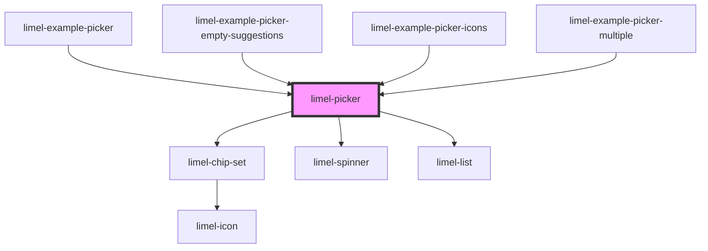

# limel-picker

<!-- Auto Generated Below -->

## Properties

| Property             | Attribute              | Description                                                                                                                                        | Type                                                         | Default     |
| -------------------- | ---------------------- | -------------------------------------------------------------------------------------------------------------------------------------------------- | ------------------------------------------------------------ | ----------- |
| `disabled`           | `disabled`             | True if the picker should be disabled                                                                                                              | `boolean`                                                    | `false`     |
| `displayFullList`    | `display-full-list`    | True if the dropdown list should be displayed without cutting the content                                                                          | `boolean`                                                    | `false`     |
| `emptyResultMessage` | `empty-result-message` | A message to display when the search returned an empty result                                                                                      | `string`                                                     | `undefined` |
| `label`              | `label`                | Text to display for the input field of the picker                                                                                                  | `string`                                                     | `undefined` |
| `multiple`           | `multiple`             | True if multiple values are allowed                                                                                                                | `boolean`                                                    | `false`     |
| `readonly`           | `readonly`             | Set to `true` to disable adding and removing items, but allow interaction with existing items.                                                     | `boolean`                                                    | `false`     |
| `required`           | `required`             | True if the control requires a value                                                                                                               | `boolean`                                                    | `false`     |
| `searchLabel`        | `search-label`         | Search label to display in the input field when searching                                                                                          | `string`                                                     | `undefined` |
| `searcher`           | --                     | A search function that takes a search-string as an argument, and returns a promise that will eventually be resolved with an array of `ListItem`:s. | `(query: string) => Promise<ListItem<any>[]>`                | `undefined` |
| `value`              | --                     | Currently selected value or values                                                                                                                 | `ListItem<string \| number> \| ListItem<string \| number>[]` | `undefined` |

## Events

| Event      | Description                                              | Type                                                                      |
| ---------- | -------------------------------------------------------- | ------------------------------------------------------------------------- |
| `change`   | Fired when a new value has been selected from the picker | `CustomEvent<ListItem<string \| number> \| ListItem<string \| number>[]>` |
| `interact` | Fired when clicking on a selected value                  | `CustomEvent<ListItem<string \| number>>`                                 |

## Dependencies

### Used by

 - [limel-example-picker](../../examples/picker)
 - [limel-example-picker-empty-suggestions](../../examples/picker)
 - [limel-example-picker-icons](../../examples/picker)
 - [limel-example-picker-multiple](../../examples/picker)

### Depends on

- [limel-chip-set](../chip-set)
- [limel-spinner](../spinner)
- [limel-list](../list)

### Graph

----------------------------------------------

*Built with [StencilJS](https://stenciljs.com/)*
