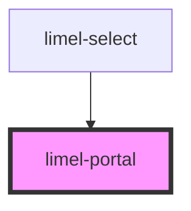

# limel-portal

<!-- Auto Generated Below -->

## Properties

| Property         | Attribute      | Description                                                                                                                                                                                             | Type          | Default         |
| ---------------- | -------------- | ------------------------------------------------------------------------------------------------------------------------------------------------------------------------------------------------------- | ------------- | --------------- |
| `containerId`    | `container-id` | A unique ID                                                                                                                                                                                             | `string`      | `undefined`     |
| `containerStyle` | --             | Dynamic styling that can be applied to the container holding the content                                                                                                                                | `object`      | `{}`            |
| `parent`         | --             | Parent element to move the content to                                                                                                                                                                   | `HTMLElement` | `document.body` |
| `visible`        | `visible`      | True if the content within the portal should be visible  If the content is from within a dialog for instance, this can be set to true from false when the dialog opens to position the content properly | `boolean`     | `false`         |

## Dependencies

### Used by

 - [limel-select](../select)

### Graph

----------------------------------------------

*Built with [StencilJS](https://stenciljs.com/)*
