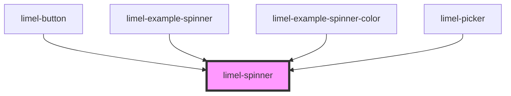

# limel-spinner

<!-- Auto Generated Below -->

## Properties

| Property | Attribute | Description                         | Type                                                    | Default  |
| -------- | --------- | ----------------------------------- | ------------------------------------------------------- | -------- |
| `size`   | `size`    | Determines the size of the spinner. | `"large" \| "medium" \| "mini" \| "small" \| "x-small"` | `'mini'` |

## Dependencies

### Used by

 - [limel-button](../button)
 - [limel-example-spinner](../../examples/spinner)
 - [limel-example-spinner-color](../../examples/spinner-color)
 - [limel-picker](../picker)

### Graph

----------------------------------------------

*Built with [StencilJS](https://stenciljs.com/)*
