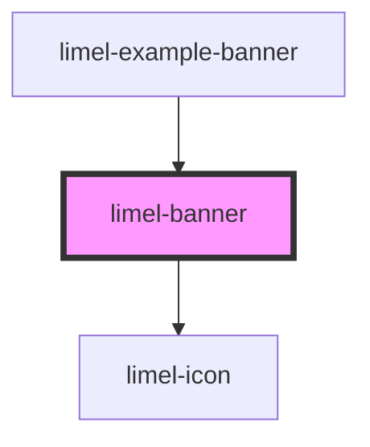

# limel-banner

<!-- Auto Generated Below -->

## Properties

| Property  | Attribute | Description                     | Type     | Default     |
| --------- | --------- | ------------------------------- | -------- | ----------- |
| `icon`    | `icon`    | Set icon for the banner         | `string` | `undefined` |
| `message` | `message` | The text to show on the banner. | `string` | `undefined` |

## Methods

### `close() => Promise<void>`

Close the banner

#### Returns

Type: `Promise<void>`

### `open() => Promise<void>`

Open the banner

#### Returns

Type: `Promise<void>`

## Dependencies

### Used by

 - [limel-example-banner](../../examples/banner)

### Depends on

- [limel-icon](../icon)

### Graph

----------------------------------------------

*Built with [StencilJS](https://stenciljs.com/)*
