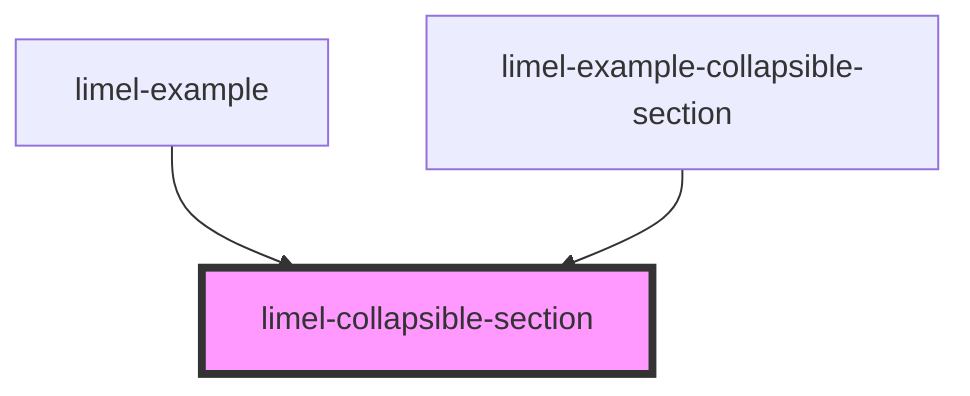

# limel-collapsible-section

<!-- Auto Generated Below -->

## Properties

| Property | Attribute | Description                                                                   | Type      | Default     |
| -------- | --------- | ----------------------------------------------------------------------------- | --------- | ----------- |
| `header` | `header`  |                                                                               | `string`  | `undefined` |
| `isOpen` | `is-open` | `true` if the section is expanded, `false` if collapsed. Defaults to `false`. | `boolean` | `false`     |

## Events

| Event   | Description                           | Type                |
| ------- | ------------------------------------- | ------------------- |
| `close` | Emitted when the section is collapsed | `CustomEvent<void>` |
| `open`  | Emitted when the section is expanded  | `CustomEvent<void>` |

## Dependencies

### Used by

 - [limel-example](../../examples)
 - [limel-example-collapsible-section](../../examples/collapsible-section)

### Graph

----------------------------------------------

*Built with [StencilJS](https://stenciljs.com/)*
