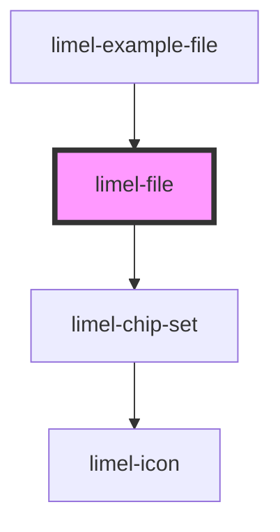

# limel-file

<!-- Auto Generated Below -->

## Properties

| Property   | Attribute  | Description                                                               | Type       | Default     |
| ---------- | ---------- | ------------------------------------------------------------------------- | ---------- | ----------- |
| `disabled` | `disabled` | True if the input should be disabled                                      | `boolean`  | `false`     |
| `label`    | `label`    | The input label.                                                          | `string`   | `undefined` |
| `required` | `required` | Set to `true` to indicate that the field is required. Defaults to `false` | `boolean`  | `false`     |
| `value`    | --         | The selected file.                                                        | `FileInfo` | `undefined` |

## Events

| Event    | Description                                   | Type                    |
| -------- | --------------------------------------------- | ----------------------- |
| `change` | Dispatched when a file is selected/deselected | `CustomEvent<FileInfo>` |

## Dependencies

### Used by

 - [limel-example-file](../../examples/file)

### Depends on

- [limel-chip-set](../chip-set)

### Graph

----------------------------------------------

*Built with [StencilJS](https://stenciljs.com/)*
