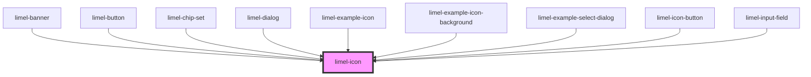

# limel-icon

<!-- Auto Generated Below -->

## Properties

| Property | Attribute | Description                                                                                                            | Type                                          | Default     |
| -------- | --------- | ---------------------------------------------------------------------------------------------------------------------- | --------------------------------------------- | ----------- |
| `badge`  | `badge`   | Set to `true` to give the icon a round background with some padding. Only works when the `size` attribute is also set. | `boolean`                                     | `undefined` |
| `name`   | `name`    | Name of the icon                                                                                                       | `string`                                      | `undefined` |
| `size`   | `size`    | Size of the icon                                                                                                       | `"large" \| "medium" \| "small" \| "x-small"` | `undefined` |

## Dependencies

### Used by

 - [limel-banner](../banner)
 - [limel-button](../button)
 - [limel-chip-set](../chip-set)
 - [limel-dialog](../dialog)
 - [limel-example-icon](../../examples/icon)
 - [limel-example-icon-background](../../examples/icon)
 - [limel-example-select-dialog](../../examples/select)
 - [limel-icon-button](../icon-button)
 - [limel-input-field](../input-field)

### Graph

----------------------------------------------

*Built with [StencilJS](https://stenciljs.com/)*
