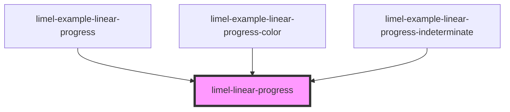

# limel-linear-progress

<!-- Auto Generated Below -->

## Properties

| Property        | Attribute       | Description                                                   | Type      | Default |
| --------------- | --------------- | ------------------------------------------------------------- | --------- | ------- |
| `indeterminate` | `indeterminate` | Puts the progress bar in an indeterminate state               | `boolean` | `false` |
| `value`         | `value`         | The value of the progress bar. Should be between `0` and `1`. | `number`  | `0`     |

## CSS Custom Properties

| Name                 | Description                          |
| -------------------- | ------------------------------------ |
| `--background-color` | Color to use for progress-bar track. |

## Dependencies

### Used by

 - [limel-example-linear-progress](../../examples/linear-progress)
 - [limel-example-linear-progress-color](../../examples/linear-progress)
 - [limel-example-linear-progress-indeterminate](../../examples/linear-progress)

### Graph

----------------------------------------------

*Built with [StencilJS](https://stenciljs.com/)*
