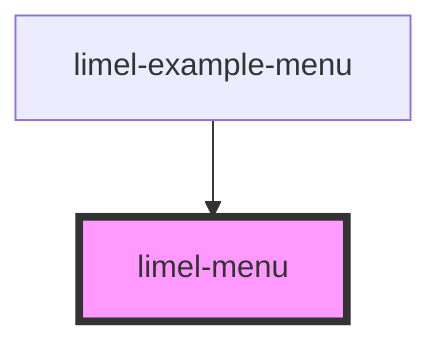

# limel-menu

<!-- Auto Generated Below -->

## Properties

| Property     | Attribute     | Description                                         | Type                                 | Default |
| ------------ | ------------- | --------------------------------------------------- | ------------------------------------ | ------- |
| `badgeIcons` | `badge-icons` | Defines whether the menu should show badges.        | `boolean`                            | `false` |
| `disabled`   | `disabled`    | Sets the disabled state of the menu.                | `boolean`                            | `false` |
| `items`      | --            | A list of items and separators to show in the menu. | `(ListItem<any> \| ListSeparator)[]` | `[]`    |
| `label`      | `label`       | Is displayed on the default trigger button.         | `string`                             | `''`    |
| `open`       | `open`        | Sets the open state of the menu.                    | `boolean`                            | `false` |

## Events

| Event    | Description                              | Type                         |
| -------- | ---------------------------------------- | ---------------------------- |
| `cancel` | Is emitted when the menu is cancelled.   | `CustomEvent<void>`          |
| `select` | Is emitted when a menu item is selected. | `CustomEvent<ListItem<any>>` |

## CSS Custom Properties

| Name                      | Description                                                                                                |
| ------------------------- | ---------------------------------------------------------------------------------------------------------- |
| `--icon-background-color` | Color to use for icon background when `badgeIcons=true`.                                                   |
| `--icon-color`            | Color to use for icon. Defaults to grey when `badgeIcons=false`. Defaults to white when `badgeIcons=true`. |

## Dependencies

### Used by

 - [limel-example-menu](../../examples/menu)

### Graph

----------------------------------------------

*Built with [StencilJS](https://stenciljs.com/)*
