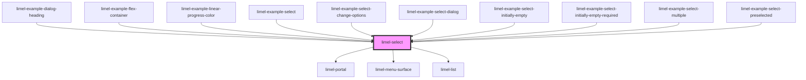

# limel-select

<!-- Auto Generated Below -->

## Properties

| Property   | Attribute  | Description                                                                | Type                                 | Default     |
| ---------- | ---------- | -------------------------------------------------------------------------- | ------------------------------------ | ----------- |
| `disabled` | `disabled` | Disables the input field when `true`. Defaults to `false`.                 | `boolean`                            | `false`     |
| `label`    | `label`    | Text to display next to the select                                         | `string`                             | `undefined` |
| `multiple` | `multiple` | Set to `true` to allow multiple values to be selected. Defaults to `false` | `boolean`                            | `false`     |
| `options`  | --         | List of options                                                            | `Option<string>[]`                   | `[]`        |
| `required` | `required` | True if the control requires a value                                       | `boolean`                            | `false`     |
| `value`    | --         | Currently selected value or values (if `multiple` is set)                  | `Option<string> \| Option<string>[]` | `undefined` |

## Events

| Event    | Description                       | Type                                              |
| -------- | --------------------------------- | ------------------------------------------------- |
| `change` | Emitted when the value is changed | `CustomEvent<Option<string> \| Option<string>[]>` |

## Dependencies

### Used by

 - [limel-example-dialog-heading](../../examples/dialog)
 - [limel-example-flex-container](../../examples/flex-container)
 - [limel-example-linear-progress-color](../../examples/linear-progress)
 - [limel-example-select](../../examples/select)
 - [limel-example-select-change-options](../../examples/select)
 - [limel-example-select-dialog](../../examples/select)
 - [limel-example-select-initially-empty](../../examples/select)
 - [limel-example-select-initially-empty-required](../../examples/select)
 - [limel-example-select-multiple](../../examples/select)
 - [limel-example-select-preselected](../../examples/select)

### Depends on

- [limel-portal](../portal)
- [limel-menu-surface](../menu-surface)
- [limel-list](../list)

### Graph

----------------------------------------------

*Built with [StencilJS](https://stenciljs.com/)*
