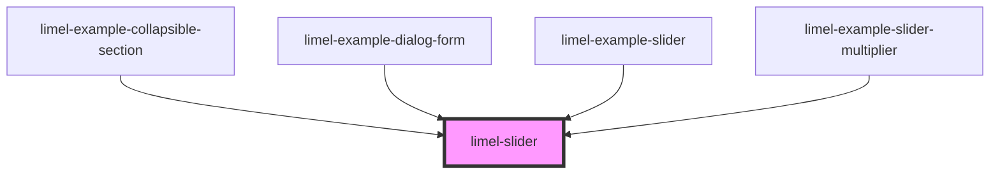

# limel-slider

<!-- Auto Generated Below -->

## Properties

| Property   | Attribute  | Description                                                                                                                                                                               | Type      | Default     |
| ---------- | ---------- | ----------------------------------------------------------------------------------------------------------------------------------------------------------------------------------------- | --------- | ----------- |
| `disabled` | `disabled` |                                                                                                                                                                                           | `boolean` | `false`     |
| `factor`   | `factor`   | Default value: 1. The factor that the properties `value`, `valuemax` and `valuemin` are multiplied by. On `change` divides the value by the factor, so the original format stays the same | `number`  | `1`         |
| `label`    | `label`    |                                                                                                                                                                                           | `string`  | `undefined` |
| `unit`     | `unit`     |                                                                                                                                                                                           | `string`  | `''`        |
| `value`    | `value`    |                                                                                                                                                                                           | `number`  | `undefined` |
| `valuemax` | `valuemax` |                                                                                                                                                                                           | `number`  | `100`       |
| `valuemin` | `valuemin` |                                                                                                                                                                                           | `number`  | `0`         |

## Events

| Event    | Description | Type                  |
| -------- | ----------- | --------------------- |
| `change` |             | `CustomEvent<number>` |

## CSS Custom Properties

| Name                                 | Description                                                           |
| ------------------------------------ | --------------------------------------------------------------------- |
| `--slider-bg-color-behind-component` | Color of "transparent" parts of disabled slider. Defaults to #ffffff. |

## Dependencies

### Used by

 - [limel-example-collapsible-section](../../examples/collapsible-section)
 - [limel-example-dialog-form](../../examples/dialog)
 - [limel-example-slider](../../examples/slider)
 - [limel-example-slider-multiplier](../../examples/slider)

### Graph

----------------------------------------------

*Built with [StencilJS](https://stenciljs.com/)*
