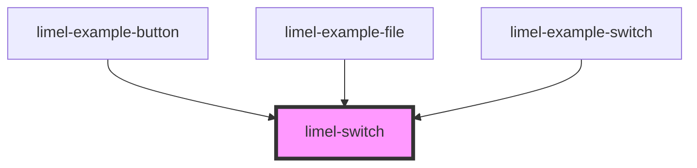

# limel-switch

<!-- Auto Generated Below -->

## Properties

| Property   | Attribute  | Description | Type      | Default     |
| ---------- | ---------- | ----------- | --------- | ----------- |
| `disabled` | `disabled` |             | `boolean` | `false`     |
| `label`    | `label`    |             | `string`  | `undefined` |
| `value`    | `value`    |             | `boolean` | `false`     |

## Events

| Event    | Description | Type                   |
| -------- | ----------- | ---------------------- |
| `change` |             | `CustomEvent<boolean>` |

## Dependencies

### Used by

 - [limel-example-button](../../examples/button)
 - [limel-example-file](../../examples/file)
 - [limel-example-switch](../../examples/switch)

### Graph

----------------------------------------------

*Built with [StencilJS](https://stenciljs.com/)*
