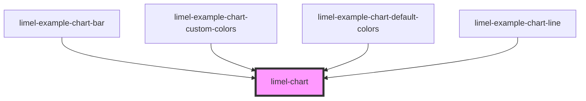

# limel-chart

<!-- Auto Generated Below -->

## Properties

| Property   | Attribute | Description                                                                                                                                                                                | Type                     | Default     |
| ---------- | --------- | ------------------------------------------------------------------------------------------------------------------------------------------------------------------------------------------ | ------------------------ | ----------- |
| `datasets` | --        | See the Chart.js documentation for your chosen [chart type](https://www.chartjs.org/docs/2.7.3/charts/).                                                                                   | `any[]`                  | `[]`        |
| `labels`   | --        | See the Chart.js documentation for [Category Cartesian Axis](https://www.chartjs.org/docs/2.7.3/axes/cartesian/category.html#category-cartesian-axis).                                     | `(string \| string[])[]` | `[]`        |
| `options`  | `options` | See the Chart.js documentation for [Global Configuration](https://www.chartjs.org/docs/2.7.3/configuration/) and for your chosen [chart type](https://www.chartjs.org/docs/2.7.3/charts/). | `any`                    | `{}`        |
| `type`     | `type`    |                                                                                                                                                                                            | `string`                 | `undefined` |

## Dependencies

### Used by

 - [limel-example-chart-bar](../../examples/chart)
 - [limel-example-chart-custom-colors](../../examples/chart)
 - [limel-example-chart-default-colors](../../examples/chart)
 - [limel-example-chart-line](../../examples/chart)

### Graph

----------------------------------------------

*Built with [StencilJS](https://stenciljs.com/)*
