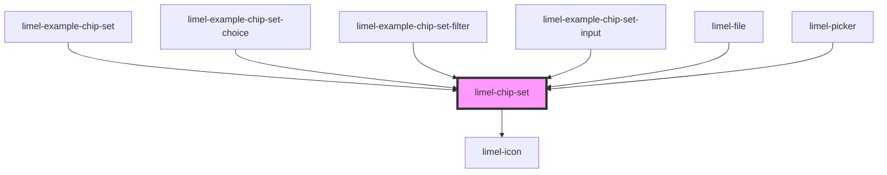

# limel-chip-set

<!-- Auto Generated Below -->

## Properties

| Property           | Attribute             | Description                                                                                                                                                                                                                                                                                                                                                                                                            | Type                              | Default     |
| ------------------ | --------------------- | ---------------------------------------------------------------------------------------------------------------------------------------------------------------------------------------------------------------------------------------------------------------------------------------------------------------------------------------------------------------------------------------------------------------------- | --------------------------------- | ----------- |
| `disabled`         | `disabled`            | True if the chip set should be disabled                                                                                                                                                                                                                                                                                                                                                                                | `boolean`                         | `false`     |
| `emptyInputOnBlur` | `empty-input-on-blur` | Whether the input field should be emptied when the chip-set loses focus.                                                                                                                                                                                                                                                                                                                                               | `boolean`                         | `true`      |
| `label`            | `label`               | Label to display for the input field when type is `input`                                                                                                                                                                                                                                                                                                                                                              | `string`                          | `undefined` |
| `maxItems`         | `max-items`           | For chip-sets of type `input`. Limits the maximum number of chips. When the value is `0` or not set, no limit is applied.                                                                                                                                                                                                                                                                                              | `number`                          | `undefined` |
| `readonly`         | `readonly`            | For chip-sets of type `input`. Set to `true` to disable adding and removing chips, but allow interaction with existing chips in the set.                                                                                                                                                                                                                                                                               | `boolean`                         | `false`     |
| `required`         | `required`            | True if the control requires a value                                                                                                                                                                                                                                                                                                                                                                                   | `boolean`                         | `false`     |
| `searchLabel`      | `search-label`        | Search label to display when type is `input` and component is in search mode                                                                                                                                                                                                                                                                                                                                           | `string`                          | `undefined` |
| `type`             | `type`                | Type of chip set  - `choice` renders a set of selectable chips where only one is selectable. The `removable` property is ignored - `filter` renders a set of selectable chips where all are selectable. The `icon` property is ignored - `input` renders a set of chips that can be used in conjunction with an input field  If no type is set, a basic set of chips without additional functionality will be rendered | `"choice" \| "filter" \| "input"` | `undefined` |
| `value`            | --                    | List of chips for the set                                                                                                                                                                                                                                                                                                                                                                                              | `Chip<any>[]`                     | `[]`        |

## Events

| Event       | Description                                                                                 | Type                                    |
| ----------- | ------------------------------------------------------------------------------------------- | --------------------------------------- |
| `change`    | Dispatched when a chip is selected/deselected                                               | `CustomEvent<Chip<any> \| Chip<any>[]>` |
| `input`     | Dispatched when the input is changed for type `input`                                       | `CustomEvent<string>`                   |
| `interact`  | Dispatched when a chip is interacted with                                                   | `CustomEvent<Chip<any>>`                |
| `startEdit` | Emitted when an input chip set has received focus and editing in the text field has started | `CustomEvent<void>`                     |
| `stopEdit`  | Emitted when an input chip set has lost focus and editing in the text field has ended       | `CustomEvent<void>`                     |

## Methods

### `emptyInput() => Promise<void>`

Used to empty the input field. Used in conjunction with `emptyInputOnBlur` to let the
consumer control when the input is emptied.

#### Returns

Type: `Promise<void>`

### `getEditMode() => Promise<boolean>`

Used to find out whether the chip-set is in edit mode.

#### Returns

Type: `Promise<boolean>`

### `setFocus(emptyInput?: boolean) => Promise<void>`

Used to set focus to the chip-set input field.

#### Returns

Type: `Promise<void>`

## CSS Custom Properties

| Name                                   | Description                                                                                        |
| -------------------------------------- | -------------------------------------------------------------------------------------------------- |
| `--background-color`                   | Background color of the field when type is set to input.                                           |
| `--background-color-disabled`          | Background color of the field when type is set to input and the component is disabled or readonly. |
| `--icon-background-color`              | Background color of the icon. Defaults to transparent.                                             |
| `--icon-color`                         | Color of the icon. Defaults to 54% black.                                                          |
| `--input-chip-set-selected-chip-color` | Color of the highlight around selected chips in input chip-sets.                                   |

## Dependencies

### Used by

 - [limel-example-chip-set](../../examples/chip-set)
 - [limel-example-chip-set-choice](../../examples/chip-set)
 - [limel-example-chip-set-filter](../../examples/chip-set)
 - [limel-example-chip-set-input](../../examples/chip-set)
 - [limel-file](../file)
 - [limel-picker](../picker)

### Depends on

- [limel-icon](../icon)

### Graph

----------------------------------------------

*Built with [StencilJS](https://stenciljs.com/)*
