# limel-flex-container

<!-- Auto Generated Below -->

## Properties

| Property    | Attribute   | Description                                        | Type                                                                                  | Default           |
| ----------- | ----------- | -------------------------------------------------- | ------------------------------------------------------------------------------------- | ----------------- |
| `align`     | `align`     | Specify how items are aligned along the cross axis | `"center" \| "end" \| "start" \| "stretch"`                                           | `'center'`        |
| `direction` | `direction` | Direction of the main axis                         | `"horizontal" \| "vertical"`                                                          | `'horizontal'`    |
| `justify`   | `justify`   | Specify how items are aligned along the main axis  | `"center" \| "end" \| "space-around" \| "space-between" \| "space-evenly" \| "start"` | `'space-between'` |
| `reverse`   | `reverse`   | Reverse the order of the items                     | `boolean`                                                                             | `false`           |

## Dependencies

### Used by

 - [limel-example-banner](../../examples/banner)
 - [limel-example-checkbox](../../examples/checkbox)
 - [limel-example-chip-set](../../examples/chip-set)
 - [limel-example-chip-set-choice](../../examples/chip-set)
 - [limel-example-chip-set-filter](../../examples/chip-set)
 - [limel-example-chip-set-input](../../examples/chip-set)
 - [limel-example-collapsible-section](../../examples/collapsible-section)
 - [limel-example-date-picker-programmatic-change](../../examples/date-picker)
 - [limel-example-dialog](../../examples/dialog)
 - [limel-example-dialog-closing-actions](../../examples/dialog)
 - [limel-example-dialog-form](../../examples/dialog)
 - [limel-example-dialog-fullscreen](../../examples/dialog)
 - [limel-example-dialog-heading](../../examples/dialog)
 - [limel-example-dialog-size](../../examples/dialog)
 - [limel-example-flex-container](../../examples/flex-container)
 - [limel-example-icon-button](../../examples/icon-button)
 - [limel-example-icon-button-toggle-state](../../examples/icon-button)
 - [limel-example-input-field-autocomplete](../../examples/input-field)
 - [limel-example-input-field-number](../../examples/input-field)
 - [limel-example-input-field-text](../../examples/input-field)
 - [limel-example-picker](../../examples/picker)
 - [limel-example-picker-empty-suggestions](../../examples/picker)
 - [limel-example-picker-icons](../../examples/picker)
 - [limel-example-picker-multiple](../../examples/picker)
 - [limel-example-select](../../examples/select)
 - [limel-example-select-change-options](../../examples/select)
 - [limel-example-select-dialog](../../examples/select)
 - [limel-example-select-multiple](../../examples/select)
 - [limel-example-slider](../../examples/slider)
 - [limel-example-switch](../../examples/switch)

### Graph

```mermaid
graph TD;
  limel-example-banner --> limel-flex-container
  limel-example-checkbox --> limel-flex-container
  limel-example-chip-set --> limel-flex-container
  limel-example-chip-set-choice --> limel-flex-container
  limel-example-chip-set-filter --> limel-flex-container
  limel-example-chip-set-input --> limel-flex-container
  limel-example-collapsible-section --> limel-flex-container
  limel-example-date-picker-programmatic-change --> limel-flex-container
  limel-example-dialog --> limel-flex-container
  limel-example-dialog-closing-actions --> limel-flex-container
  limel-example-dialog-form --> limel-flex-container
  limel-example-dialog-fullscreen --> limel-flex-container
  limel-example-dialog-heading --> limel-flex-container
  limel-example-dialog-size --> limel-flex-container
  limel-example-flex-container --> limel-flex-container
  limel-example-icon-button --> limel-flex-container
  limel-example-icon-button-toggle-state --> limel-flex-container
  limel-example-input-field-autocomplete --> limel-flex-container
  limel-example-input-field-number --> limel-flex-container
  limel-example-input-field-text --> limel-flex-container
  limel-example-picker --> limel-flex-container
  limel-example-picker-empty-suggestions --> limel-flex-container
  limel-example-picker-icons --> limel-flex-container
  limel-example-picker-multiple --> limel-flex-container
  limel-example-select --> limel-flex-container
  limel-example-select-change-options --> limel-flex-container
  limel-example-select-dialog --> limel-flex-container
  limel-example-select-multiple --> limel-flex-container
  limel-example-slider --> limel-flex-container
  limel-example-switch --> limel-flex-container
  style limel-flex-container fill:#f9f,stroke:#333,stroke-width:4px
```

----------------------------------------------

*Built with [StencilJS](https://stenciljs.com/)*
