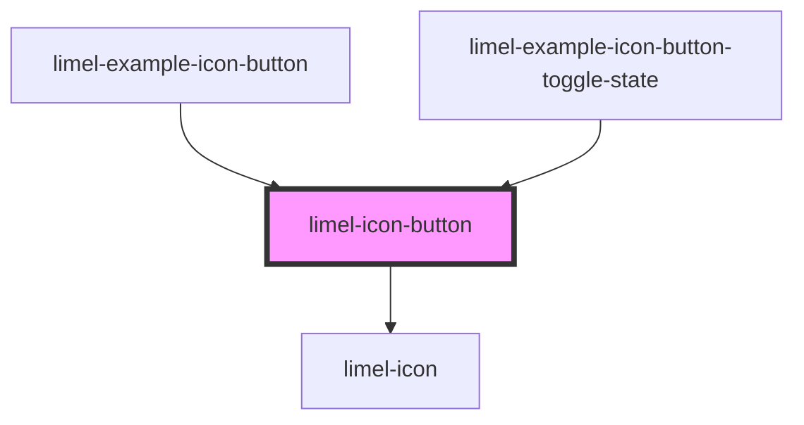

# limel-icon-button

<!-- Auto Generated Below -->

## Properties

| Property   | Attribute  | Description                                                 | Type      | Default     |
| ---------- | ---------- | ----------------------------------------------------------- | --------- | ----------- |
| `disabled` | `disabled` | Set to `true` to disable the button. Defaults to `false`.   | `boolean` | `false`     |
| `icon`     | `icon`     | The icon to display.                                        | `string`  | `undefined` |
| `label`    | `label`    | The text to show to screenreaders and other assistive tech. | `string`  | `undefined` |

## Methods

### `relayout() => Promise<void>`

If the button is hidden or inside another element that is animating
while the button is instantiated, the hover-highlight may become
misaligned. If so, calling this method will make the button re-layout
the highlight.

#### Returns

Type: `Promise<void>`

## Dependencies

### Used by

 - [limel-example-icon-button](../../examples/icon-button)
 - [limel-example-icon-button-toggle-state](../../examples/icon-button)

### Depends on

- [limel-icon](../icon)

### Graph

----------------------------------------------

*Built with [StencilJS](https://stenciljs.com/)*
