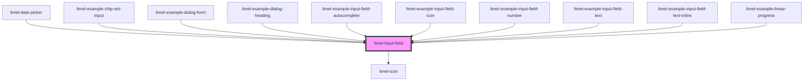

# limel-input-field

<!-- Auto Generated Below -->

## Properties

| Property       | Attribute       | Description                                                                                                                                                                                   | Type       | Default     |
| -------------- | --------------- | --------------------------------------------------------------------------------------------------------------------------------------------------------------------------------------------- | ---------- | ----------- |
| `completions`  | --              | list of suggestions `value` can autocomplete to.                                                                                                                                              | `string[]` | `[]`        |
| `disabled`     | `disabled`      | Disables the input field when `true`. Defaults to `false`.                                                                                                                                    | `boolean`  | `false`     |
| `formatNumber` | `format-number` | Set to `true` to format the current value of the input field only if the field is of type number. The number format is determined by the current language of the browser. Defaults to `true`. | `boolean`  | `true`      |
| `invalid`      | `invalid`       | Set to `true` to indicate that the current value of the input field is invalid. Defaults to `false`.                                                                                          | `boolean`  | `false`     |
| `label`        | `label`         | The input label.                                                                                                                                                                              | `string`   | `undefined` |
| `required`     | `required`      | Set to `true` to indicate that the field is required. Defaults to `false`.                                                                                                                    | `boolean`  | `false`     |
| `trailingIcon` | `trailing-icon` | Trailing icon to show to the far right in the field                                                                                                                                           | `string`   | `undefined` |
| `type`         | `type`          | This property determines the html-type of the field and with that which keyboard to show on a mobile device. Defaults to 'text'                                                               | `string`   | `'text'`    |
| `value`        | `value`         | The value of the field.                                                                                                                                                                       | `string`   | `undefined` |

## Events

| Event    | Description                                                            | Type                  |
| -------- | ---------------------------------------------------------------------- | --------------------- |
| `action` | Emitted when the `trailingIcon` is set and the icon is interacted with | `CustomEvent<void>`   |
| `change` | Emitted when the input value is changed.                               | `CustomEvent<string>` |

## CSS Custom Properties

| Name                 | Description                    |
| -------------------- | ------------------------------ |
| `--background-color` | Background color of the field. |

## Dependencies

### Used by

 - [limel-date-picker](../date-picker)
 - [limel-example-chip-set-input](../../examples/chip-set)
 - [limel-example-dialog-form](../../examples/dialog)
 - [limel-example-dialog-heading](../../examples/dialog)
 - [limel-example-input-field-autocomplete](../../examples/input-field)
 - [limel-example-input-field-icon](../../examples/input-field)
 - [limel-example-input-field-number](../../examples/input-field)
 - [limel-example-input-field-text](../../examples/input-field)
 - [limel-example-input-field-text-inline](../../examples/input-field)
 - [limel-example-linear-progress](../../examples/linear-progress)

### Depends on

- [limel-icon](../icon)

### Graph

----------------------------------------------

*Built with [StencilJS](https://stenciljs.com/)*
