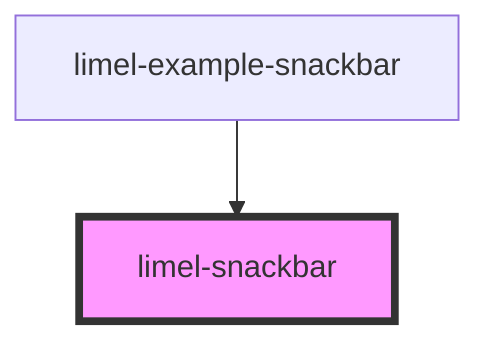

# limel-snackbar

<!-- Auto Generated Below -->

## Properties

| Property      | Attribute     | Description                                                        | Type      | Default     |
| ------------- | ------------- | ------------------------------------------------------------------ | --------- | ----------- |
| `actionText`  | `action-text` | The text to display for the action button.                         | `string`  | `undefined` |
| `dismissible` | `dismissible` | True if the snackbar is dismissible, false otherwise               | `boolean` | `undefined` |
| `message`     | `message`     | The text message to display.                                       | `string`  | `undefined` |
| `multiline`   | `multiline`   | Whether to show the snackbar with space for multiple lines of text | `boolean` | `undefined` |
| `timeout`     | `timeout`     | The amount of time in milliseconds to show the snackbar.           | `number`  | `undefined` |

## Events

| Event    | Description                               | Type                |
| -------- | ----------------------------------------- | ------------------- |
| `action` | Emitted when the action button is pressed | `CustomEvent<void>` |
| `hide`   | Emitted when the snackbar hides itself    | `CustomEvent<void>` |

## Methods

### `show() => Promise<void>`

Show the snackbar

#### Returns

Type: `Promise<void>`

## Dependencies

### Used by

 - [limel-example-snackbar](../../examples/snackbar)

### Graph

----------------------------------------------

*Built with [StencilJS](https://stenciljs.com/)*
