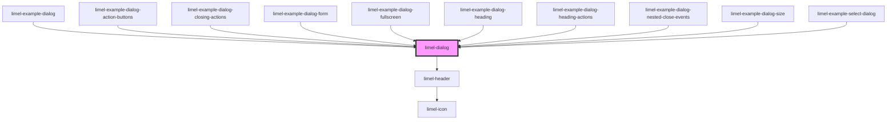

# limel-dialog

<!-- Auto Generated Below -->

## Overview

:::note
Regarding the `close` event: When putting other elements that emit `close`
events inside a dialog, those events must be caught and stopped inside the
dialog. If not, they will bubble to the event handler listening for `close`
events on the dialog, which will close the dialog too.

See the example _Nested `close` events_.
:::

:::important
Are you developing for
[Lime CRM](https://www.lime-technologies.com/en/lime-crm/)? Please note that
you should use the [DialogRenderer](https://lundalogik.github.io/lime-web-components/versions/latest/interfaces/DialogRenderer.html)
from Lime Web Components to open dialogs in Lime CRM.
:::

## Properties

| Property         | Attribute    | Description                                      | Type                      | Default                                                      |
| ---------------- | ------------ | ------------------------------------------------ | ------------------------- | ------------------------------------------------------------ |
| `closingActions` | --           | Defines which action triggers a close-event.     | `ClosingActions`          | `{         escapeKey: true,         scrimClick: true,     }` |
| `fullscreen`     | `fullscreen` | Set to `true` to make the dialog "fullscreen".   | `boolean`                 | `false`                                                      |
| `heading`        | `heading`    | The heading for the dialog, if any.              | `DialogHeading \| string` | `undefined`                                                  |
| `open`           | `open`       | `true` if the dialog is open, `false` otherwise. | `boolean`                 | `false`                                                      |

## Events

| Event     | Description                                                                                                                         | Type                |
| --------- | ----------------------------------------------------------------------------------------------------------------------------------- | ------------------- |
| `close`   | Emitted when the dialog is closed from inside the component. (*Not* emitted when the consumer sets the `open`-property to `false`.) | `CustomEvent<void>` |
| `closing` | Emitted when the dialog is in the process of being closed.                                                                          | `CustomEvent<void>` |

## Slots

| Slot               | Description                      |
| ------------------ | -------------------------------- |
|                    | Content to put inside the dialog |
| `"button"`         | The dialog buttons               |
| `"header-actions"` | The dialog header buttons        |

## Dependencies

### Used by

 - [limel-example-dialog](examples)
 - [limel-example-dialog-action-buttons](examples)
 - [limel-example-dialog-closing-actions](examples)
 - [limel-example-dialog-form](examples)
 - [limel-example-dialog-fullscreen](examples)
 - [limel-example-dialog-heading](examples)
 - [limel-example-dialog-heading-actions](examples)
 - [limel-example-dialog-nested-close-events](examples)
 - [limel-example-dialog-size](examples)
 - [limel-example-select-dialog](../select/examples)

### Depends on

- [limel-header](../header)

### Graph

----------------------------------------------

*Built with [StencilJS](https://stenciljs.com/)*
