# limel-list

<!-- Auto Generated Below -->

## Properties

| Property                | Attribute                  | Description                                                                                                                                                                                                                                                           | Type                                          | Default     |
| ----------------------- | -------------------------- | --------------------------------------------------------------------------------------------------------------------------------------------------------------------------------------------------------------------------------------------------------------------- | --------------------------------------------- | ----------- |
| `badgeIcons`            | `badge-icons`              | Set to `true` if the list should display larger icons with a background                                                                                                                                                                                               | `boolean`                                     | `undefined` |
| `iconSize`              | `icon-size`                | Size of the icons in the list                                                                                                                                                                                                                                         | `"large" \| "medium" \| "small" \| "x-small"` | `'small'`   |
| `items`                 | --                         | List of items to display                                                                                                                                                                                                                                              | `(ListSeparator \| ListItem<any>)[]`          | `undefined` |
| `maxLinesSecondaryText` | `max-lines-secondary-text` | By default, lists will display 3 lines of text, and then truncate the rest. Consumers can increase or decrease this number by specifying `maxLinesSecondaryText`. If consumer enters zero or negative numbers we default to 1; and if they type decimals we round up. | `number`                                      | `3`         |
| `type`                  | `type`                     | The type of the list, omit to get a regular list. Available types are: `selectable`: regular list with single selection. `radio`: radio button list with single selection. `checkbox`: checkbox list with multiple selection.                                         | `"checkbox" \| "radio" \| "selectable"`       | `undefined` |

## Events

| Event      | Description                                                                                                                 | Type                                            |
| ---------- | --------------------------------------------------------------------------------------------------------------------------- | ----------------------------------------------- |
| `change`   | Fired when a new value has been selected from the list. Only fired if `type` is set to `selectable`, `radio` or `checkbox`. | `CustomEvent<ListItem<any> \| ListItem<any>[]>` |
| `interact` | Fires when a user interacts with an item in the list (e.g., click, keyboard select).                                        | `CustomEvent<ListItem<any>>`                    |
| `select`   | Fired when an action has been selected from the action menu of a list item                                                  | `CustomEvent<ListItem<any> \| ListItem<any>[]>` |

## Dependencies

### Used by

 - [limel-example-action-bar-as-primary-component](../action-bar/examples)
 - [limel-example-action-bar-icon-title](../action-bar/examples)
 - [limel-example-boolean-radio-buttons](../../design-guidelines/boolean/examples)
 - [limel-example-list](examples)
 - [limel-example-list-action](examples)
 - [limel-example-list-badge-icons](examples)
 - [limel-example-list-badge-icons-with-multiple-lines](examples)
 - [limel-example-list-checkbox-icons](examples)
 - [limel-example-list-grid](examples)
 - [limel-example-list-icons](examples)
 - [limel-example-list-pictures](examples)
 - [limel-example-list-primary-component](examples)
 - [limel-example-list-radio-button-icons](examples)
 - [limel-example-list-secondary](examples)
 - [limel-example-list-selectable](examples)
 - [limel-example-list-separator](examples)
 - [limel-example-list-striped](examples)
 - [limel-input-field](../input-field)
 - [limel-picker](../picker)
 - [limel-radio-button-group](../radio-button-group)
 - [limel-select](../select)
 - [my-custom-menu](../dock/examples)
 - [my-custom-menu-with-notifications](../dock/examples)

### Graph

```mermaid
graph TD;
  limel-example-action-bar-as-primary-component --> limel-list
  limel-example-action-bar-icon-title --> limel-list
  limel-example-boolean-radio-buttons --> limel-list
  limel-example-list --> limel-list
  limel-example-list-action --> limel-list
  limel-example-list-badge-icons --> limel-list
  limel-example-list-badge-icons-with-multiple-lines --> limel-list
  limel-example-list-checkbox-icons --> limel-list
  limel-example-list-grid --> limel-list
  limel-example-list-icons --> limel-list
  limel-example-list-pictures --> limel-list
  limel-example-list-primary-component --> limel-list
  limel-example-list-radio-button-icons --> limel-list
  limel-example-list-secondary --> limel-list
  limel-example-list-selectable --> limel-list
  limel-example-list-separator --> limel-list
  limel-example-list-striped --> limel-list
  limel-input-field --> limel-list
  limel-picker --> limel-list
  limel-radio-button-group --> limel-list
  limel-select --> limel-list
  my-custom-menu --> limel-list
  my-custom-menu-with-notifications --> limel-list
  style limel-list fill:#f9f,stroke:#333,stroke-width:4px
```

----------------------------------------------

*Built with [StencilJS](https://stenciljs.com/)*
