# limel-checkbox

<!-- Auto Generated Below -->

## Overview

The Checkbox component is a classic and essential element in UI design that allows
users to make multiple selections from a predefined list of options. The Checkbox component is commonly used in forms and settings interfaces to enable users to
select one or more items from a list of choices.

## States of a Checkbox
When a user clicks or taps on the box, it toggles between two states:
Checked and Unchecked.

However, a Checkbox can visualize a third state called the "Indeterminate" state.
In this state, the checkbox appears as a filled box with a horizontal line or dash inside it.

The Indeterminate state is typically used when dealing with checkbox groups
that have hierarchical relationships or when the group contains sub-items.
This state is used to indicate that that some, but not all, of the items in a group are selected.

:::important
Checkboxes are sometimes used interchangeably with switches in user interfaces.
But there is an important difference between the two! Please read our guidelines about
[Switch vs. Checkbox](/#/DesignGuidelines/switch-vs-checkbox.md/).

## Properties

| Property         | Attribute       | Description                                                                                                                                                                              | Type               | Default     |
| ---------------- | --------------- | ---------------------------------------------------------------------------------------------------------------------------------------------------------------------------------------- | ------------------ | ----------- |
| `checked`        | `checked`       | The value of the checkbox. Set to `true` to make the checkbox checked.                                                                                                                   | `boolean`          | `false`     |
| `disabled`       | `disabled`      | Disables the checkbox when `true`. Works exactly the same as `readonly`. If either property is `true`, the checkbox will be disabled.                                                    | `boolean`          | `false`     |
| `helperText`     | `helper-text`   | Optional helper text to display below the checkbox                                                                                                                                       | `string`           | `undefined` |
| `indeterminate`  | `indeterminate` | Enables indeterminate state. Set to `true` to signal indeterminate check.                                                                                                                | `boolean`          | `false`     |
| `invalid`        | `invalid`       | Set to `true` to indicate that the current value is invalid.                                                                                                                             | `boolean`          | `undefined` |
| `label`          | `label`         | The checkbox label.                                                                                                                                                                      | `string`           | `undefined` |
| `readonly`       | `readonly`      | Disables the checkbox when `true`. This visualizes the checkbox slightly differently. But shows no visual sign indicating that the checkbox is disabled or can ever become interactable. | `boolean`          | `false`     |
| `readonlyLabels` | --              | The labels to use to clarify what kind of data is being visualized, when the component is `readonly`.                                                                                    | `Label<boolean>[]` | `[]`        |
| `required`       | `required`      | Set to `true` to indicate that the checkbox must be checked.                                                                                                                             | `boolean`          | `false`     |

## Events

| Event    | Description                              | Type                   |
| -------- | ---------------------------------------- | ---------------------- |
| `change` | Emitted when the input value is changed. | `CustomEvent<boolean>` |

## Dependencies

### Used by

 - [limel-example-action-bar-icon-title](../action-bar/examples)
 - [limel-example-ai-avatar-basic](../ai-avatar/examples)
 - [limel-example-ai-avatar-colors](../ai-avatar/examples)
 - [limel-example-audition-form](../../design-guidelines/boolean/examples)
 - [limel-example-audition-form-readonly](../../design-guidelines/boolean/examples)
 - [limel-example-boolean-checkboxes](../../design-guidelines/boolean/examples)
 - [limel-example-button-disabled-vs-hidden](../../design-guidelines/disabled-hidden/examples)
 - [limel-example-button-group](../button-group/examples)
 - [limel-example-button-group-icons](../button-group/examples)
 - [limel-example-button-group-mix](../button-group/examples)
 - [limel-example-chart-accessibility](../chart/examples)
 - [limel-example-checkbox](examples)
 - [limel-example-checkbox-helper-text](examples)
 - [limel-example-checkbox-readonly](examples)
 - [limel-example-chip-button](../chip/examples)
 - [limel-example-chip-loading](../chip/examples)
 - [limel-example-chip-set](../chip-set/examples)
 - [limel-example-chip-set-choice](../chip-set/examples)
 - [limel-example-chip-set-filter](../chip-set/examples)
 - [limel-example-chip-set-filter-badge](../chip-set/examples)
 - [limel-example-chip-set-input](../chip-set/examples)
 - [limel-example-color-picker-composite](../color-picker/examples)
 - [limel-example-color-picker-custom-palette](../color-picker/examples)
 - [limel-example-color-picker-manual-input](../color-picker/examples)
 - [limel-example-dialog-action-buttons](../dialog/examples)
 - [limel-example-dynamic-label](../dynamic-label/examples)
 - [limel-example-dynamic-label-readonly-boolean](../dynamic-label/examples)
 - [limel-example-file](../file/examples)
 - [limel-example-file-dropzone](../file-dropzone/examples)
 - [limel-example-file-input](../file-input/examples)
 - [limel-example-file-input-type-filtering](../file-input/examples)
 - [limel-example-helper-line-animation](../helper-line/examples)
 - [limel-example-info-tile-loading](../info-tile/examples)
 - [limel-example-input-field-autocomplete](../input-field/examples)
 - [limel-example-input-field-number](../input-field/examples)
 - [limel-example-input-field-showlink](../input-field/examples)
 - [limel-example-input-field-text](../input-field/examples)
 - [limel-example-input-field-text-decluttering-guidelines](../../design-guidelines/declutter/examples)
 - [limel-example-input-field-text-multiple](../input-field/examples)
 - [limel-example-input-field-textarea](../input-field/examples)
 - [limel-example-list-badge-icons](../list/examples)
 - [limel-example-list-checkbox-icons](../list/examples)
 - [limel-example-list-item-checkbox](../list-item/examples)
 - [limel-example-list-item-icon](../list-item/examples)
 - [limel-example-list-item-icon-size](../list-item/examples)
 - [limel-example-list-item-pictures](../list-item/examples)
 - [limel-example-list-item-radio](../list-item/examples)
 - [limel-example-list-pictures](../list/examples)
 - [limel-example-list-radio-button-icons](../list/examples)
 - [limel-example-notched-outline-basic](../notched-outline/examples)
 - [limel-example-placement](../help/examples)
 - [limel-example-profile-picture-composite](../profile-picture/examples)
 - [limel-example-profile-picture-loading](../profile-picture/examples)
 - [limel-example-progress-flow-basic](../progress-flow/examples)
 - [limel-example-radio-button-group-basic](../radio-button-group/examples)
 - [limel-example-radio-button-group-deselect-selected](../radio-button-group/examples)
 - [limel-example-readonly-props](../../design-guidelines/boolean/examples)
 - [limel-example-select](../select/examples)
 - [limel-example-select-multiple](../select/examples)
 - [limel-example-select-with-empty-option](../select/examples)
 - [limel-example-size](../../design-guidelines/size/examples)
 - [limel-example-size-edge-case](../../design-guidelines/size/examples)
 - [limel-example-slider-basic](../slider/examples)
 - [limel-example-slider-multiplier-percentage-colors](../slider/examples)
 - [limel-example-snackbar-dismissible](../snackbar/examples)
 - [limel-example-spinner](../spinner/examples)
 - [limel-example-spinner-color](../spinner/examples)
 - [limel-example-switch](../switch/examples)
 - [limel-example-switch-helper-text](../switch/examples)
 - [limel-example-switch-readonly](../switch/examples)
 - [limel-example-switch-vs-checkbox](../../design-guidelines/boolean/examples)
 - [limel-example-table-sorting-disabled](../table/examples)
 - [limel-example-text-editor-allow-resize](../text-editor/examples)
 - [limel-example-text-editor-composite](../text-editor/examples)
 - [limel-example-text-editor-with-html](../text-editor/examples)
 - [limel-example-text-editor-with-inline-images-file-storage](../text-editor/examples)
 - [limel-example-text-editor-with-markdown](../text-editor/examples)
 - [limel-example-text-editor-with-tables](../text-editor/examples)
 - [limel-table](../table)
 - [limel-whats-new-example-slider](../../examples/whats-new/examples)

### Depends on

- [limel-dynamic-label](../dynamic-label)
- [limel-helper-line](../helper-line)

### Graph

```mermaid
graph TD;
  limel-checkbox --> limel-dynamic-label
  limel-checkbox --> limel-helper-line
  limel-dynamic-label --> limel-icon
  limel-example-action-bar-icon-title --> limel-checkbox
  limel-example-ai-avatar-basic --> limel-checkbox
  limel-example-ai-avatar-colors --> limel-checkbox
  limel-example-audition-form --> limel-checkbox
  limel-example-audition-form-readonly --> limel-checkbox
  limel-example-boolean-checkboxes --> limel-checkbox
  limel-example-button-disabled-vs-hidden --> limel-checkbox
  limel-example-button-group --> limel-checkbox
  limel-example-button-group-icons --> limel-checkbox
  limel-example-button-group-mix --> limel-checkbox
  limel-example-chart-accessibility --> limel-checkbox
  limel-example-checkbox --> limel-checkbox
  limel-example-checkbox-helper-text --> limel-checkbox
  limel-example-checkbox-readonly --> limel-checkbox
  limel-example-chip-button --> limel-checkbox
  limel-example-chip-loading --> limel-checkbox
  limel-example-chip-set --> limel-checkbox
  limel-example-chip-set-choice --> limel-checkbox
  limel-example-chip-set-filter --> limel-checkbox
  limel-example-chip-set-filter-badge --> limel-checkbox
  limel-example-chip-set-input --> limel-checkbox
  limel-example-color-picker-composite --> limel-checkbox
  limel-example-color-picker-custom-palette --> limel-checkbox
  limel-example-color-picker-manual-input --> limel-checkbox
  limel-example-dialog-action-buttons --> limel-checkbox
  limel-example-dynamic-label --> limel-checkbox
  limel-example-dynamic-label-readonly-boolean --> limel-checkbox
  limel-example-file --> limel-checkbox
  limel-example-file-dropzone --> limel-checkbox
  limel-example-file-input --> limel-checkbox
  limel-example-file-input-type-filtering --> limel-checkbox
  limel-example-helper-line-animation --> limel-checkbox
  limel-example-info-tile-loading --> limel-checkbox
  limel-example-input-field-autocomplete --> limel-checkbox
  limel-example-input-field-number --> limel-checkbox
  limel-example-input-field-showlink --> limel-checkbox
  limel-example-input-field-text --> limel-checkbox
  limel-example-input-field-text-decluttering-guidelines --> limel-checkbox
  limel-example-input-field-text-multiple --> limel-checkbox
  limel-example-input-field-textarea --> limel-checkbox
  limel-example-list-badge-icons --> limel-checkbox
  limel-example-list-checkbox-icons --> limel-checkbox
  limel-example-list-item-checkbox --> limel-checkbox
  limel-example-list-item-icon --> limel-checkbox
  limel-example-list-item-icon-size --> limel-checkbox
  limel-example-list-item-pictures --> limel-checkbox
  limel-example-list-item-radio --> limel-checkbox
  limel-example-list-pictures --> limel-checkbox
  limel-example-list-radio-button-icons --> limel-checkbox
  limel-example-notched-outline-basic --> limel-checkbox
  limel-example-placement --> limel-checkbox
  limel-example-profile-picture-composite --> limel-checkbox
  limel-example-profile-picture-loading --> limel-checkbox
  limel-example-progress-flow-basic --> limel-checkbox
  limel-example-radio-button-group-basic --> limel-checkbox
  limel-example-radio-button-group-deselect-selected --> limel-checkbox
  limel-example-readonly-props --> limel-checkbox
  limel-example-select --> limel-checkbox
  limel-example-select-multiple --> limel-checkbox
  limel-example-select-with-empty-option --> limel-checkbox
  limel-example-size --> limel-checkbox
  limel-example-size-edge-case --> limel-checkbox
  limel-example-slider-basic --> limel-checkbox
  limel-example-slider-multiplier-percentage-colors --> limel-checkbox
  limel-example-snackbar-dismissible --> limel-checkbox
  limel-example-spinner --> limel-checkbox
  limel-example-spinner-color --> limel-checkbox
  limel-example-switch --> limel-checkbox
  limel-example-switch-helper-text --> limel-checkbox
  limel-example-switch-readonly --> limel-checkbox
  limel-example-switch-vs-checkbox --> limel-checkbox
  limel-example-table-sorting-disabled --> limel-checkbox
  limel-example-text-editor-allow-resize --> limel-checkbox
  limel-example-text-editor-composite --> limel-checkbox
  limel-example-text-editor-with-html --> limel-checkbox
  limel-example-text-editor-with-inline-images-file-storage --> limel-checkbox
  limel-example-text-editor-with-markdown --> limel-checkbox
  limel-example-text-editor-with-tables --> limel-checkbox
  limel-table --> limel-checkbox
  limel-whats-new-example-slider --> limel-checkbox
  style limel-checkbox fill:#f9f,stroke:#333,stroke-width:4px
```

----------------------------------------------

*Built with [StencilJS](https://stenciljs.com/)*
