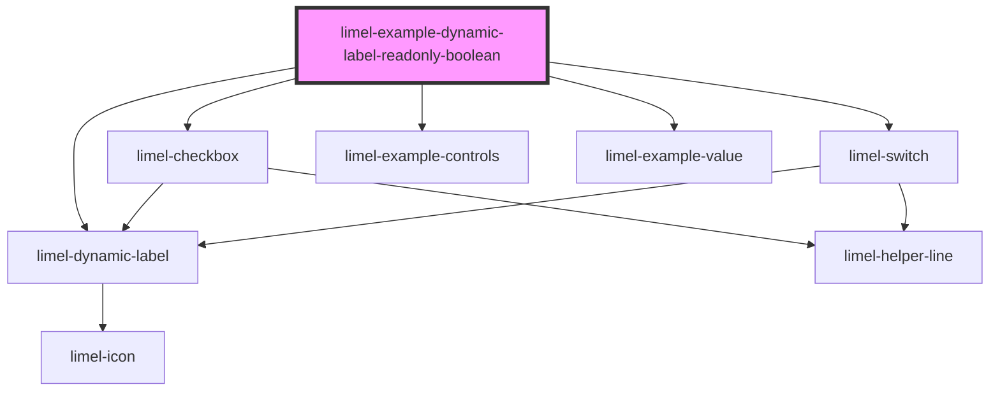

# limel-example-dynamic-label-readonly-boolean

<!-- Auto Generated Below -->

## Overview

Readonly boolean
The `readonly` mode of a boolean fields do not always
clearly communicate the meaning of the data to the end users. Similar problems
have existed in user interfaces forever, and it not solely limited to
readonly-ness of a boolean field. If you are interested in reading more
about these common design problems, you can check out
[**State-Switch Controls:** The Infamous Case of the "Mute" Button](https://www.nngroup.com/articles/state-switch-buttons/)

In short, the reason end-users become confused is that it is not enough to
keep the same label for both `true` and `false` states,
and only rely on changing the color or the
shapes and visual motifs, to communicate what the field means.

Instead, we need to use different labels to describe the state,
and also get some additional help from icons and colors
to clarify further if needed.

:::important
This example shows how to setup the `limel-dynamic-label` component to
create a more descriptive and dynamic labels for boolean fields.
But please make sure to read our guidelines about
[Labeling boolean fields](/#/DesignGuidelines/labeling-boolean-fields.md/)
to understand the importance of this, and get help in choosing the right labels
for boolean fields.
:::

## Dependencies

### Depends on

- [limel-dynamic-label](..)
- [limel-checkbox](../../checkbox)
- [limel-switch](../../switch)
- [limel-example-controls](../../../examples)
- [limel-example-value](../../../examples)

### Graph

----------------------------------------------

*Built with [StencilJS](https://stenciljs.com/)*
