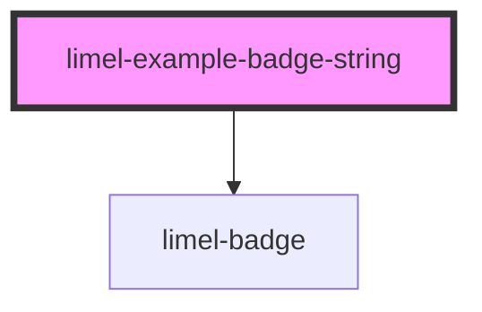

# limel-example-badge-string

<!-- Auto Generated Below -->

## Overview

String badges

String labels get truncated if their visual length is longer than
six characters placed side by side (six `0`s to be exact).

When users hover the truncated badge, the complete
`label` will be displayed in a tooltip.

## Dependencies

### Depends on

- [limel-badge](..)

### Graph

----------------------------------------------

*Built with [StencilJS](https://stenciljs.com/)*
