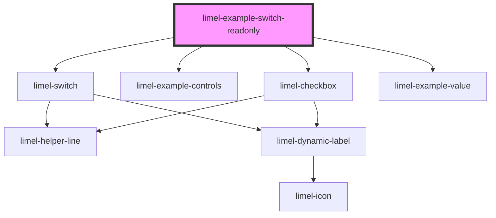

# limel-example-switch-readonly

<!-- Auto Generated Below -->

## Overview

Customizing the visualization of the `readonly` state
It is possible and recommended that you enhance the visualization of a `boolean` field
in a `readonly` state.

Because depending on the context, the default UI of the `readonly` state may not always
provide the best way of _visualizing information_, potentially leading to
confusion and negatively affecting the end-users' experience.

:::important
Before reading the documentations below, make sure to read
1. our guides about the difference between
[Disabled vs. Readonly](#/DesignGuidelines/disabled-vs-readonly.md/) in our components.
2. our guidelines about [Labeling boolean fields](#/DesignGuidelines/labeling-boolean-fields.md/).
:::

Using the `readonlyLabels` optional prop, you can override the `label` and
customize it accordingly. Additionally, by using the `icon` prop, you can
override the default icons and their colors.

## Dependencies

### Depends on

- [limel-switch](..)
- [limel-example-controls](../../../examples)
- [limel-checkbox](../../checkbox)
- [limel-example-value](../../../examples)

### Graph

----------------------------------------------

*Built with [StencilJS](https://stenciljs.com/)*
