# limel-switch

<!-- Auto Generated Below -->

## Overview

The Switch component is a fundamental element in UI design that serves as a toggle switch
to control the state of a specific setting or option in an application or website.
The two distinct positions of the Switch are visually indicative of the two states:
ON and OFF; making it easy for users to understand the current state of the controlled feature.

The Switch component is widely used in user interfaces to enable users to
quickly and intuitively change binary settings.

:::important
Checkboxes are sometimes used interchangeably with switches in user interfaces.
But there is an important difference between the two! Please read our guidelines about
[Switch vs. Checkbox](#/DesignGuidelines/switch-vs-checkbox.md/).

## Properties

| Property         | Attribute     | Description                                                                                                                                                                                  | Type               | Default     |
| ---------------- | ------------- | -------------------------------------------------------------------------------------------------------------------------------------------------------------------------------------------- | ------------------ | ----------- |
| `disabled`       | `disabled`    | Disables the switch when `true`, and visually shows that the switch is editable but disabled. This tells the users that if certain requirements are met, the switch may become interactable. | `boolean`          | `false`     |
| `helperText`     | `helper-text` | Optional helper text to display below the switch                                                                                                                                             | `string`           | `undefined` |
| `invalid`        | `invalid`     | Set to `true` to indicate that the current value is invalid.                                                                                                                                 | `boolean`          | `undefined` |
| `label`          | `label`       | Label to display next to the switch                                                                                                                                                          | `string`           | `undefined` |
| `readonly`       | `readonly`    | Disables the switch when `true`. This visualizes the switch slightly differently. But shows no visual sign indicating that the switch is disabled or can ever become interactable.           | `boolean`          | `false`     |
| `readonlyLabels` | --            | The labels to use to clarify what kind of data is being visualized, when the component is `readonly`.                                                                                        | `Label<boolean>[]` | `[]`        |
| `value`          | `value`       | The value of the switch                                                                                                                                                                      | `boolean`          | `false`     |

## Events

| Event    | Description                        | Type                   |
| -------- | ---------------------------------- | ---------------------- |
| `change` | Emitted when the value has changed | `CustomEvent<boolean>` |

## Dependencies

### Used by

 - [limel-example-button-composite](../button/examples)
 - [limel-example-button-group](../button-group/examples)
 - [limel-example-button-group-icons](../button-group/examples)
 - [limel-example-button-group-mix](../button-group/examples)
 - [limel-example-checkbox](../checkbox/examples)
 - [limel-example-checkbox-readonly](../checkbox/examples)
 - [limel-example-chip-button](../chip/examples)
 - [limel-example-chip-loading](../chip/examples)
 - [limel-example-chip-set](../chip-set/examples)
 - [limel-example-chip-set-choice](../chip-set/examples)
 - [limel-example-chip-set-filter](../chip-set/examples)
 - [limel-example-chip-set-filter-badge](../chip-set/examples)
 - [limel-example-chip-set-input](../chip-set/examples)
 - [limel-example-dialog-nested-close-events](../dialog/examples)
 - [limel-example-dynamic-label](../dynamic-label/examples)
 - [limel-example-dynamic-label-readonly-boolean](../dynamic-label/examples)
 - [limel-example-file](../file/examples)
 - [limel-example-form-span-fields](../form/examples)
 - [limel-example-icon-button-composite](../icon-button/examples)
 - [limel-example-info-tile-loading](../info-tile/examples)
 - [limel-example-input-field-autocomplete](../input-field/examples)
 - [limel-example-input-field-number](../input-field/examples)
 - [limel-example-input-field-showlink](../input-field/examples)
 - [limel-example-input-field-text](../input-field/examples)
 - [limel-example-input-field-text-multiple](../input-field/examples)
 - [limel-example-input-field-textarea](../input-field/examples)
 - [limel-example-list-badge-icons](../list/examples)
 - [limel-example-list-checkbox-icons](../list/examples)
 - [limel-example-list-item-actions](../list-item/examples)
 - [limel-example-list-item-interactive](../list-item/examples)
 - [limel-example-list-item-primary-component](../list-item/examples)
 - [limel-example-list-pictures](../list/examples)
 - [limel-example-list-radio-button-icons](../list/examples)
 - [limel-example-profile-picture-composite](../profile-picture/examples)
 - [limel-example-profile-picture-loading](../profile-picture/examples)
 - [limel-example-progress-flow-basic](../progress-flow/examples)
 - [limel-example-radio-button-group-basic](../radio-button-group/examples)
 - [limel-example-radio-button-group-deselect-selected](../radio-button-group/examples)
 - [limel-example-readonly-props](../../design-guidelines/boolean/examples)
 - [limel-example-select](../select/examples)
 - [limel-example-select-multiple](../select/examples)
 - [limel-example-select-with-empty-option](../select/examples)
 - [limel-example-slider-basic](../slider/examples)
 - [limel-example-slider-multiplier-percentage-colors](../slider/examples)
 - [limel-example-snackbar-persistent-non-dismissible](../snackbar/examples)
 - [limel-example-spinner](../spinner/examples)
 - [limel-example-spinner-color](../spinner/examples)
 - [limel-example-switch](examples)
 - [limel-example-switch-helper-text](examples)
 - [limel-example-switch-readonly](examples)
 - [limel-example-switch-vs-checkbox](../../design-guidelines/boolean/examples)
 - [limel-example-text-editor-allow-resize](../text-editor/examples)
 - [limel-example-text-editor-composite](../text-editor/examples)
 - [limel-example-text-editor-with-html](../text-editor/examples)
 - [limel-example-text-editor-with-markdown](../text-editor/examples)
 - [limel-example-text-editor-with-tables](../text-editor/examples)

### Depends on

- [limel-helper-line](../helper-line)
- [limel-dynamic-label](../dynamic-label)

### Graph

```mermaid
graph TD;
  limel-switch --> limel-helper-line
  limel-switch --> limel-dynamic-label
  limel-dynamic-label --> limel-icon
  limel-example-button-composite --> limel-switch
  limel-example-button-group --> limel-switch
  limel-example-button-group-icons --> limel-switch
  limel-example-button-group-mix --> limel-switch
  limel-example-checkbox --> limel-switch
  limel-example-checkbox-readonly --> limel-switch
  limel-example-chip-button --> limel-switch
  limel-example-chip-loading --> limel-switch
  limel-example-chip-set --> limel-switch
  limel-example-chip-set-choice --> limel-switch
  limel-example-chip-set-filter --> limel-switch
  limel-example-chip-set-filter-badge --> limel-switch
  limel-example-chip-set-input --> limel-switch
  limel-example-dialog-nested-close-events --> limel-switch
  limel-example-dynamic-label --> limel-switch
  limel-example-dynamic-label-readonly-boolean --> limel-switch
  limel-example-file --> limel-switch
  limel-example-form-span-fields --> limel-switch
  limel-example-icon-button-composite --> limel-switch
  limel-example-info-tile-loading --> limel-switch
  limel-example-input-field-autocomplete --> limel-switch
  limel-example-input-field-number --> limel-switch
  limel-example-input-field-showlink --> limel-switch
  limel-example-input-field-text --> limel-switch
  limel-example-input-field-text-multiple --> limel-switch
  limel-example-input-field-textarea --> limel-switch
  limel-example-list-badge-icons --> limel-switch
  limel-example-list-checkbox-icons --> limel-switch
  limel-example-list-item-actions --> limel-switch
  limel-example-list-item-interactive --> limel-switch
  limel-example-list-item-primary-component --> limel-switch
  limel-example-list-pictures --> limel-switch
  limel-example-list-radio-button-icons --> limel-switch
  limel-example-profile-picture-composite --> limel-switch
  limel-example-profile-picture-loading --> limel-switch
  limel-example-progress-flow-basic --> limel-switch
  limel-example-radio-button-group-basic --> limel-switch
  limel-example-radio-button-group-deselect-selected --> limel-switch
  limel-example-readonly-props --> limel-switch
  limel-example-select --> limel-switch
  limel-example-select-multiple --> limel-switch
  limel-example-select-with-empty-option --> limel-switch
  limel-example-slider-basic --> limel-switch
  limel-example-slider-multiplier-percentage-colors --> limel-switch
  limel-example-snackbar-persistent-non-dismissible --> limel-switch
  limel-example-spinner --> limel-switch
  limel-example-spinner-color --> limel-switch
  limel-example-switch --> limel-switch
  limel-example-switch-helper-text --> limel-switch
  limel-example-switch-readonly --> limel-switch
  limel-example-switch-vs-checkbox --> limel-switch
  limel-example-text-editor-allow-resize --> limel-switch
  limel-example-text-editor-composite --> limel-switch
  limel-example-text-editor-with-html --> limel-switch
  limel-example-text-editor-with-markdown --> limel-switch
  limel-example-text-editor-with-tables --> limel-switch
  style limel-switch fill:#f9f,stroke:#333,stroke-width:4px
```

----------------------------------------------

*Built with [StencilJS](https://stenciljs.com/)*
