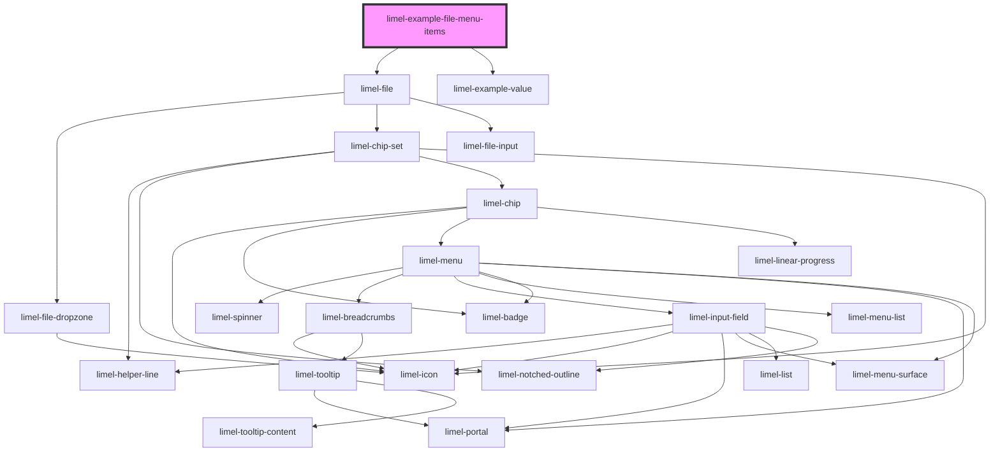

# limel-example-file-menu-items

<!-- Auto Generated Below -->

## Overview

Custom menu items

By providing custom menu items, you can add additional actions.

## Dependencies

### Depends on

- [limel-file](..)
- [limel-example-value](../../../examples)

### Graph

----------------------------------------------

*Built with [StencilJS](https://stenciljs.com/)*
