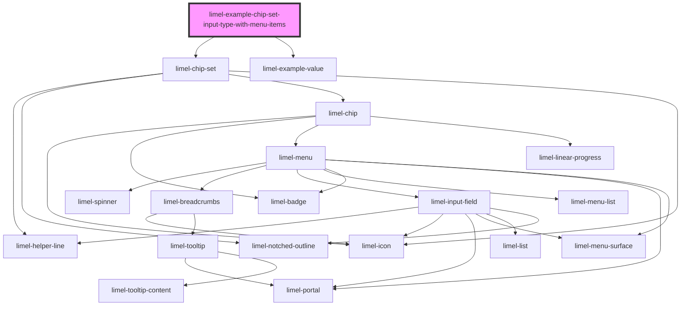

# limel-example-chip-set-input-type-with-menu-items

<!-- Auto Generated Below -->

## Overview

Input chip set, containing items with menus
While chips inside a chip set of `type="input"` can be clicked on, resulting in
an action, they can also have an ellipsis menu which will provide the end users with
additional actions.

When a menu item is selected from the ellipsis menu, the `onMenuItemSelected` event
will be emitted, reflecting the `value` of the selected item.

:::note
When a chip has `removable={true}` and when there are menu items, the "remove button" on the
chip will be automatically added as the last item in the ellipsis menu.

Clicking the remove button will emit the same `onRemove` event.
:::

## Dependencies

### Depends on

- [limel-chip-set](..)
- [limel-example-value](../../../examples)

### Graph

----------------------------------------------

*Built with [StencilJS](https://stenciljs.com/)*
