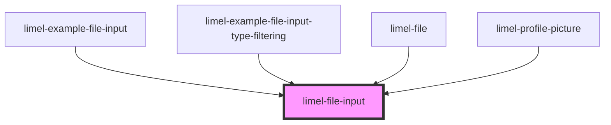

# limel-file-input

<!-- Auto Generated Below -->

## Overview

This component enables you to seamlessly transform any other clickable component that
generates a `click` event into a file input selector.

To use it, just wrap any clickable component inside the `limel-file-input` component.
Upon reception of the `click` event this component will open the native file selection
dialog.

After receiving the files, the component emits a `filesSelected` event.

The event detail would be an array of `FileInfo` objects,
each representing a file dropped into the dropzone.

## Properties

| Property   | Attribute  | Description                                                                                                                                                                                                                                                                                                                                                                                          | Type      | Default |
| ---------- | ---------- | ---------------------------------------------------------------------------------------------------------------------------------------------------------------------------------------------------------------------------------------------------------------------------------------------------------------------------------------------------------------------------------------------------- | --------- | ------- |
| `accept`   | `accept`   | Specifies the types of files that the dropzone will accept. By default, all file types are accepted.  For media files, formats can be specified using: `audio/*`, `video/*`, `image/*`. Unique file type specifiers can also be used, for example: `.jpg`, `.pdf`. A comma-separated list of file extensions or MIME types is also acceptable, e.g., `image/png, image/jpeg` or `.png, .jpg, .jpeg`. | `string`  | `'*'`   |
| `disabled` | `disabled` | Set to `true` to disable file input selection.                                                                                                                                                                                                                                                                                                                                                       | `boolean` | `false` |
| `multiple` | `multiple` | Set to `true` to enable selection of multiple files                                                                                                                                                                                                                                                                                                                                                  | `boolean` | `false` |

## Events

| Event           | Description                     | Type                      |
| --------------- | ------------------------------- | ------------------------- |
| `filesSelected` | Emitted when files are selected | `CustomEvent<FileInfo[]>` |

## Dependencies

### Used by

 - [limel-example-file-input](examples)
 - [limel-example-file-input-type-filtering](examples)
 - [limel-file](../file)
 - [limel-profile-picture](../profile-picture)

### Graph

----------------------------------------------

*Built with [StencilJS](https://stenciljs.com/)*
