# limel-helper-line

<!-- Auto Generated Below -->

## Overview

This is an internal and private component that many input fields
use to display a helper text, along with a character counter below the
input field.

We created this to keep the visual styles the same everywhere
and to avoid importing styles separately.

Also this enables us to open the helper line in limel-portal,
more easily without having to send the styles to the portal.

## Properties

| Property       | Attribute        | Description                                                                                                                                                      | Type      | Default     |
| -------------- | ---------------- | ---------------------------------------------------------------------------------------------------------------------------------------------------------------- | --------- | ----------- |
| `helperText`   | `helper-text`    | The helper text that is displayed on the left side.                                                                                                              | `string`  | `undefined` |
| `helperTextId` | `helper-text-id` | Used by `aria-controls` and `aria-describedby` in the parent component.                                                                                          | `string`  | `undefined` |
| `invalid`      | `invalid`        | Turns `true`, when the parent component is invalid. For example, when the parent component is `required` but is left empty. Or when the input format is invalid. | `boolean` | `false`     |
| `length`       | `length`         | Length of the current input value, coming from the parent component. Used in the character counter section on the right side.                                    | `number`  | `undefined` |
| `maxLength`    | `max-length`     | Maximum length of the characters, defined on the parent component. Used in the character counter section on the right side.                                      | `number`  | `undefined` |

## Dependencies

### Used by

 - [limel-checkbox](../checkbox)
 - [limel-chip-set](../chip-set)
 - [limel-code-editor](../code-editor)
 - [limel-example-helper-line](examples)
 - [limel-example-helper-line-animation](examples)
 - [limel-example-helper-line-character-counter](examples)
 - [limel-example-helper-line-empty](examples)
 - [limel-example-helper-line-invalid](examples)
 - [limel-example-helper-line-long-text](examples)
 - [limel-example-helper-line-long-text-no-counter](examples)
 - [limel-input-field](../input-field)
 - [limel-list-item](../list-item)
 - [limel-select](../select)
 - [limel-slider](../slider)
 - [limel-switch](../switch)
 - [limel-text-editor](../text-editor)

### Graph

```mermaid
graph TD;
  limel-checkbox --> limel-helper-line
  limel-chip-set --> limel-helper-line
  limel-code-editor --> limel-helper-line
  limel-example-helper-line --> limel-helper-line
  limel-example-helper-line-animation --> limel-helper-line
  limel-example-helper-line-character-counter --> limel-helper-line
  limel-example-helper-line-empty --> limel-helper-line
  limel-example-helper-line-invalid --> limel-helper-line
  limel-example-helper-line-long-text --> limel-helper-line
  limel-example-helper-line-long-text-no-counter --> limel-helper-line
  limel-input-field --> limel-helper-line
  limel-list-item --> limel-helper-line
  limel-select --> limel-helper-line
  limel-slider --> limel-helper-line
  limel-switch --> limel-helper-line
  limel-text-editor --> limel-helper-line
  style limel-helper-line fill:#f9f,stroke:#333,stroke-width:4px
```

----------------------------------------------

*Built with [StencilJS](https://stenciljs.com/)*
