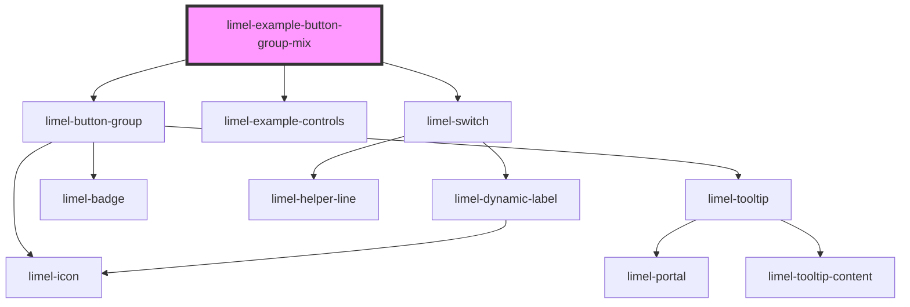

# limel-example-button-group-mix

<!-- Auto Generated Below -->

## Overview

Mixed text and icon within the same group

Generally, you should avoid mixing text and images in button group. Although
individual buttons can contain text or images, mixing the two in a single
group can lead to an inconsistent and confusing interface.

However, in some case your design may benefit from having only one button in
a different format.

## Dependencies

### Depends on

- [limel-button-group](..)
- [limel-example-controls](../../../examples)
- [limel-switch](../../switch)

### Graph

----------------------------------------------

*Built with [StencilJS](https://stenciljs.com/)*
