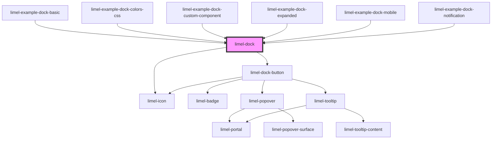

# limel-dock

<!-- Auto Generated Below -->

## Properties

| Property           | Attribute            | Description                                                                                                                                                                                                                                                                                        | Type         | Default                     |
| ------------------ | -------------------- | -------------------------------------------------------------------------------------------------------------------------------------------------------------------------------------------------------------------------------------------------------------------------------------------------- | ------------ | --------------------------- |
| `accessibleLabel`  | `accessible-label`   | A label used to describe the purpose of the navigation element to users of assistive technologies, like screen readers. Especially useful when there are multiple navigation elements in the user interface. Example value: "Primary navigation"                                                   | `string`     | `undefined`                 |
| `allowResize`      | `allow-resize`       | Set to `false` if you do not want to allow end-users to exapnd or shrink the Dock. This will hide the expand/shrink button, and the only things that defines the layout will be the `expanded` property, and the `mobileBreakPoint`.                                                               | `boolean`    | `true`                      |
| `dockFooterItems`  | --                   | Items that are placed at the bottom of the dock. (Or at the end in mobile layout.)                                                                                                                                                                                                                 | `DockItem[]` | `[]`                        |
| `dockItems`        | --                   | Items that are placed in the dock.                                                                                                                                                                                                                                                                 | `DockItem[]` | `[]`                        |
| `expanded`         | `expanded`           | Defines the width of the component, when it loads. - `true`: shows both icons and labels of the Dock items. - `false`: only shows icons of the doc items, and displays their labels as tooltip.  Note: when `useMobileLayout` is `true`, labels will always be shown as tooltips. Read more below… | `boolean`    | `false`                     |
| `mobileBreakPoint` | `mobile-break-point` | Defines the breakpoint in pixles, at which the component will be rendered in a hoizontal layout. Default breakpoint is `700` pixels, which means when the screen size is smaller than `700px`, the component will automatically switch to a horizontal layout.                                     | `number`     | `DEFAULT_MOBILE_BREAKPOINT` |

## Events

| Event          | Description                                             | Type                    |
| -------------- | ------------------------------------------------------- | ----------------------- |
| `close`        | Fired when the popover is closed.                       | `CustomEvent<void>`     |
| `dockExpanded` | Fired when a Dock is expanded or collapsed.             | `CustomEvent<boolean>`  |
| `itemSelected` | Fired when a dock item has been selected from the dock. | `CustomEvent<DockItem>` |
| `menuOpen`     | Fired when a dock menu is opened.                       | `CustomEvent<DockItem>` |

## Dependencies

### Used by

 - [limel-example-dock-basic](examples)
 - [limel-example-dock-colors-css](examples)
 - [limel-example-dock-custom-component](examples)
 - [limel-example-dock-expanded](examples)
 - [limel-example-dock-mobile](examples)
 - [limel-example-dock-notification](examples)

### Depends on

- [limel-dock-button](dock-button)
- [limel-icon](../icon)

### Graph

----------------------------------------------

*Built with [StencilJS](https://stenciljs.com/)*
