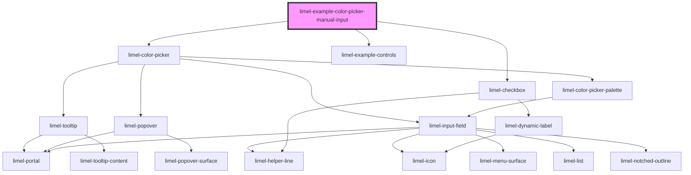

# limel-example-color-picker-manual-input

<!-- Auto Generated Below -->

## Overview

Disallowing manual input
By default, users can not only pick a color from the palette,
but also type in any valid color name or color value.

By setting the `manualInput` to `false` you can easily prevent users from
typing a custom color value into the input field.

Naturally, setting this prop to `false` does not completely disable the color picker.
It will only allow users to pick from the provided color palette.

## Dependencies

### Depends on

- [limel-color-picker](..)
- [limel-example-controls](../../../examples)
- [limel-checkbox](../../checkbox)

### Graph

----------------------------------------------

*Built with [StencilJS](https://stenciljs.com/)*
