# limel-menu

<!-- Auto Generated Below -->

## Properties

| Property             | Attribute              | Description                                                                                                                                                                                                                                        | Type                                                                                                                                                                 | Default                         |
| -------------------- | ---------------------- | -------------------------------------------------------------------------------------------------------------------------------------------------------------------------------------------------------------------------------------------------- | -------------------------------------------------------------------------------------------------------------------------------------------------------------------- | ------------------------------- |
| `badgeIcons`         | `badge-icons`          | Defines whether the menu should show badges.                                                                                                                                                                                                       | `boolean`                                                                                                                                                            | `false`                         |
| `disabled`           | `disabled`             | Sets the disabled state of the menu.                                                                                                                                                                                                               | `boolean`                                                                                                                                                            | `false`                         |
| `emptyResultMessage` | `empty-result-message` | Message to display when search returns 0 results.                                                                                                                                                                                                  | `string`                                                                                                                                                             | `undefined`                     |
| `gridLayout`         | `grid-layout`          | Renders list items in a grid layout, rather than a vertical list                                                                                                                                                                                   | `boolean`                                                                                                                                                            | `false`                         |
| `items`              | --                     | A list of items and separators to show in the menu.                                                                                                                                                                                                | `(ListSeparator \| MenuItem<any>)[]`                                                                                                                                 | `[]`                            |
| `open`               | `open`                 | Sets the open state of the menu.                                                                                                                                                                                                                   | `boolean`                                                                                                                                                            | `false`                         |
| `openDirection`      | `open-direction`       | Decides the menu's location in relation to its trigger                                                                                                                                                                                             | `"bottom" \| "bottom-end" \| "bottom-start" \| "left" \| "left-end" \| "left-start" \| "right" \| "right-end" \| "right-start" \| "top" \| "top-end" \| "top-start"` | `'bottom-start'`                |
| `rootItem`           | --                     | A root breadcrumb item to show above the menu items. Clicking it navigates back from a sub-menu to the root menu.                                                                                                                                  | `BreadcrumbsItem`                                                                                                                                                    | `DEFAULT_ROOT_BREADCRUMBS_ITEM` |
| `searchPlaceholder`  | `search-placeholder`   | Placeholder text for the search input field.                                                                                                                                                                                                       | `string`                                                                                                                                                             | `undefined`                     |
| `searcher`           | --                     | A search function that takes a search-string as an argument, and returns a promise that will eventually be resolved with an array of `MenuItem`:s.  See the docs for the type `MenuSearcher` for type information on the searcher function itself. | `(query: string) => Promise<(ListSeparator \| MenuItem<any>)[]>`                                                                                                     | `undefined`                     |
| `surfaceWidth`       | `surface-width`        | Decides the width of menu's dropdown                                                                                                                                                                                                               | `"inherit-from-items" \| "inherit-from-menu" \| "inherit-from-trigger"`                                                                                              | `'inherit-from-items'`          |

## Events

| Event          | Description                                              | Type                         |
| -------------- | -------------------------------------------------------- | ---------------------------- |
| `cancel`       | Is emitted when the menu is cancelled.                   | `CustomEvent<void>`          |
| `navigateMenu` | Is emitted when a menu item with a sub-menu is selected. | `CustomEvent<MenuItem<any>>` |
| `select`       | Is emitted when a menu item is selected.                 | `CustomEvent<MenuItem<any>>` |

## Slots

| Slot        | Description                               |
| ----------- | ----------------------------------------- |
| `"trigger"` | Element to use as a trigger for the menu. |

## Dependencies

### Used by

 - [limel-action-bar-overflow-menu](../action-bar/action-bar-item)
 - [limel-chip](../chip)
 - [limel-example-header-menu](../table/examples)
 - [limel-example-menu-badge-icons](examples)
 - [limel-example-menu-basic](examples)
 - [limel-example-menu-composite](examples)
 - [limel-example-menu-disabled](examples)
 - [limel-example-menu-grid](examples)
 - [limel-example-menu-hotkeys](examples)
 - [limel-example-menu-icons](examples)
 - [limel-example-menu-notification](examples)
 - [limel-example-menu-open-direction](examples)
 - [limel-example-menu-open-sub-menu-programmatically](examples)
 - [limel-example-menu-searchable](examples)
 - [limel-example-menu-secondary-text](examples)
 - [limel-example-menu-separators](examples)
 - [limel-example-menu-sub-menu-lazy-loading](examples)
 - [limel-example-menu-sub-menu-lazy-loading-infinite](examples)
 - [limel-example-menu-sub-menus](examples)
 - [limel-example-menu-surface-width](examples)
 - [limel-file-viewer](../file-viewer)
 - [limel-list-item](../list-item)
 - [limel-split-button](../split-button)

### Depends on

- [limel-spinner](../spinner)
- [limel-breadcrumbs](../breadcrumbs)
- [limel-input-field](../input-field)
- [limel-menu-list](../menu-list)
- [limel-badge](../badge)
- [limel-portal](../portal)
- [limel-menu-surface](../menu-surface)

### Graph

```mermaid
graph TD;
  limel-menu --> limel-spinner
  limel-menu --> limel-breadcrumbs
  limel-menu --> limel-input-field
  limel-menu --> limel-menu-list
  limel-menu --> limel-badge
  limel-menu --> limel-portal
  limel-menu --> limel-menu-surface
  limel-breadcrumbs --> limel-icon
  limel-breadcrumbs --> limel-tooltip
  limel-tooltip --> limel-portal
  limel-tooltip --> limel-tooltip-content
  limel-input-field --> limel-helper-line
  limel-input-field --> limel-icon
  limel-input-field --> limel-portal
  limel-input-field --> limel-menu-surface
  limel-input-field --> limel-list
  limel-input-field --> limel-notched-outline
  limel-action-bar-overflow-menu --> limel-menu
  limel-chip --> limel-menu
  limel-example-header-menu --> limel-menu
  limel-example-menu-badge-icons --> limel-menu
  limel-example-menu-basic --> limel-menu
  limel-example-menu-composite --> limel-menu
  limel-example-menu-disabled --> limel-menu
  limel-example-menu-grid --> limel-menu
  limel-example-menu-hotkeys --> limel-menu
  limel-example-menu-icons --> limel-menu
  limel-example-menu-notification --> limel-menu
  limel-example-menu-open-direction --> limel-menu
  limel-example-menu-open-sub-menu-programmatically --> limel-menu
  limel-example-menu-searchable --> limel-menu
  limel-example-menu-secondary-text --> limel-menu
  limel-example-menu-separators --> limel-menu
  limel-example-menu-sub-menu-lazy-loading --> limel-menu
  limel-example-menu-sub-menu-lazy-loading-infinite --> limel-menu
  limel-example-menu-sub-menus --> limel-menu
  limel-example-menu-surface-width --> limel-menu
  limel-file-viewer --> limel-menu
  limel-list-item --> limel-menu
  limel-split-button --> limel-menu
  style limel-menu fill:#f9f,stroke:#333,stroke-width:4px
```

----------------------------------------------

*Built with [StencilJS](https://stenciljs.com/)*
