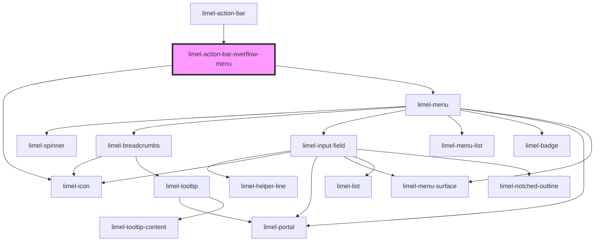

<!-- Auto Generated Below -->

## Properties

| Property        | Attribute        | Description                                                                                                                                                                                                                                                                                                   | Type                                                                                                                                                                 | Default        |
| --------------- | ---------------- | ------------------------------------------------------------------------------------------------------------------------------------------------------------------------------------------------------------------------------------------------------------------------------------------------------------- | -------------------------------------------------------------------------------------------------------------------------------------------------------------------- | -------------- |
| `items`         | --               | List of the items that should be rendered in the overflow menu.                                                                                                                                                                                                                                               | `(ListSeparator \| MenuItem<any>)[]`                                                                                                                                 | `undefined`    |
| `openDirection` | `open-direction` | Defines the location that the content of the overflow menu appears, in relation to its trigger. It defaults to `bottom-end`, since in normal scenarios (for example when the action bar is not floating at the bottom of the screen) this menu is the right-most item in the user interface of the component. | `"bottom" \| "bottom-end" \| "bottom-start" \| "left" \| "left-end" \| "left-start" \| "right" \| "right-end" \| "right-start" \| "top" \| "top-end" \| "top-start"` | `'bottom-end'` |
| `overFlowIcon`  | --               | Icon to display in the overflow menu trigger. If not provided, the number of items in the overflow menu will be displayed.                                                                                                                                                                                    | `Icon`                                                                                                                                                               | `undefined`    |

## Events

| Event    | Description                                                          | Type                                                                     |
| -------- | -------------------------------------------------------------------- | ------------------------------------------------------------------------ |
| `select` | Fired when an item in the action bar overflow menu has been clicked. | `CustomEvent<ActionBarItemOnlyIcon<any> \| ActionBarItemWithLabel<any>>` |

## Dependencies

### Used by

 - [limel-action-bar](..)

### Depends on

- [limel-icon](../../icon)
- [limel-menu](../../menu)

### Graph

----------------------------------------------

*Built with [StencilJS](https://stenciljs.com/)*
