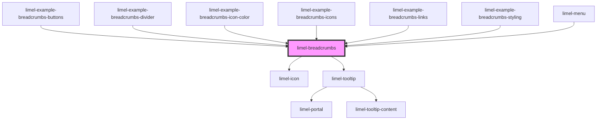

<!-- Auto Generated Below -->

## Overview

A Breadcrumb consists of a list of distinct "places" that a user has gone through,
before ending up where they are right now, in a website or an application.

These "places" can be for example _pages_ of a website, which are hierarchically
laid out before the current page that the user is looking at.
They could also be _steps_ which the user has gone through, which perhaps have no
hierarchical relation with each other, but has eventually led the user "here".

:::note
- Where the user currently is, is always the last step of the breadcrumb.
- A breadcrumbs never shows where users can go after this place.
It only illustrates where user has been before ending up here.
If the path that a user can take is not changing and if next steps are clear,
you can use the [Progress flow component](#/component/limel-progress-flow) instead.
:::

Breadcrumbs are often placed horizontally before the main content of the current screen.

## Properties

| Property  | Attribute | Description                                                                                | Type                | Default     |
| --------- | --------- | ------------------------------------------------------------------------------------------ | ------------------- | ----------- |
| `divider` | `divider` | The visual divider that separates items. It must be a single character such as `-` or `,`. | `string`            | `'›'`       |
| `items`   | --        | List of items in the breadcrumbs, each representing a step or a page.                      | `BreadcrumbsItem[]` | `undefined` |

## Events

| Event    | Description                                                         | Type                           |
| -------- | ------------------------------------------------------------------- | ------------------------------ |
| `select` | Fired when clicking on buttons (not links!) inside the breadcrumbs. | `CustomEvent<BreadcrumbsItem>` |

## Dependencies

### Used by

 - [limel-example-breadcrumbs-buttons](examples)
 - [limel-example-breadcrumbs-divider](examples)
 - [limel-example-breadcrumbs-icon-color](examples)
 - [limel-example-breadcrumbs-icons](examples)
 - [limel-example-breadcrumbs-links](examples)
 - [limel-example-breadcrumbs-styling](examples)
 - [limel-menu](../menu)

### Depends on

- [limel-icon](../icon)
- [limel-tooltip](../tooltip)

### Graph

----------------------------------------------

*Built with [StencilJS](https://stenciljs.com/)*
