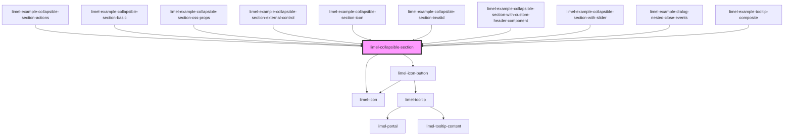

<!-- Auto Generated Below -->

## Overview

A collapsible section can be used to group related content together
and hide the group when not needed.
Using this component can help to:
- Save vertical space by hiding non-essential content
- Improve content organization and scannability of the user interface
- Reduce cognitive load by displaying only a set of relevant information at a time
- Or disclose complex information, progressively to the user

## Properties

| Property   | Attribute  | Description                                                                                                                      | Type                                                                   | Default     |
| ---------- | ---------- | -------------------------------------------------------------------------------------------------------------------------------- | ---------------------------------------------------------------------- | ----------- |
| `actions`  | --         | Actions to place to the far right inside the header                                                                              | `Action[]`                                                             | `undefined` |
| `header`   | `header`   | Text to display in the header of the section                                                                                     | `string`                                                               | `undefined` |
| `icon`     | `icon`     | Icon to display in the header of the section                                                                                     | `Icon \| string`                                                       | `undefined` |
| `invalid`  | `invalid`  | `true` if the section is invalid, `false` if valid. This can be used to indicate that the content inside the section is invalid. | `boolean`                                                              | `false`     |
| `isOpen`   | `is-open`  | `true` if the section is expanded, `false` if collapsed.                                                                         | `boolean`                                                              | `false`     |
| `language` | `language` | Defines the language for translations. Will translate the translatable strings on the components.                                | `"da" \| "de" \| "en" \| "fi" \| "fr" \| "nb" \| "nl" \| "no" \| "sv"` | `'en'`      |

## Events

| Event    | Description                                         | Type                  |
| -------- | --------------------------------------------------- | --------------------- |
| `action` | Emitted when an action is clicked inside the header | `CustomEvent<Action>` |
| `close`  | Emitted when the section is collapsed               | `CustomEvent<void>`   |
| `open`   | Emitted when the section is expanded                | `CustomEvent<void>`   |

## Slots

| Slot       | Description                                   |
| ---------- | --------------------------------------------- |
|            | Content to put inside the collapsible section |
| `"header"` | Optional slot for custom header content       |

## Dependencies

### Used by

 - [limel-example-collapsible-section-actions](examples)
 - [limel-example-collapsible-section-basic](examples)
 - [limel-example-collapsible-section-css-props](examples)
 - [limel-example-collapsible-section-external-control](examples)
 - [limel-example-collapsible-section-icon](examples)
 - [limel-example-collapsible-section-invalid](examples)
 - [limel-example-collapsible-section-with-custom-header-component](examples)
 - [limel-example-collapsible-section-with-slider](examples)
 - [limel-example-dialog-nested-close-events](../dialog/examples)
 - [limel-example-tooltip-composite](../tooltip/examples)

### Depends on

- [limel-icon](../icon)
- [limel-icon-button](../icon-button)

### Graph

----------------------------------------------

*Built with [StencilJS](https://stenciljs.com/)*
