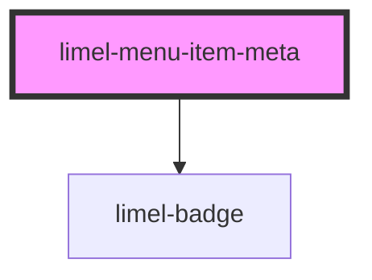

<!-- Auto Generated Below -->

## Overview

Meta content for menu list items

This sub-component is intended to be passed as `primaryComponent`
to `limel-list-item`, when it is used in the menu list.
It includes command text, badge, and chevron, which are the
features of menu list items.

## Properties

| Property      | Attribute      | Description                                                             | Type               | Default     |
| ------------- | -------------- | ----------------------------------------------------------------------- | ------------------ | ----------- |
| `badge`       | `badge`        | Optional badge value                                                    | `number \| string` | `undefined` |
| `commandText` | `command-text` | Use to display optional keyboard shortcut or command hint, e.g. `⌘ + K` | `string`           | `undefined` |
| `showChevron` | `show-chevron` | Shows a submenu chevron to indicate nested items                        | `boolean`          | `false`     |

## Dependencies

### Depends on

- [limel-badge](../../badge)

### Graph

----------------------------------------------

*Built with [StencilJS](https://stenciljs.com/)*
