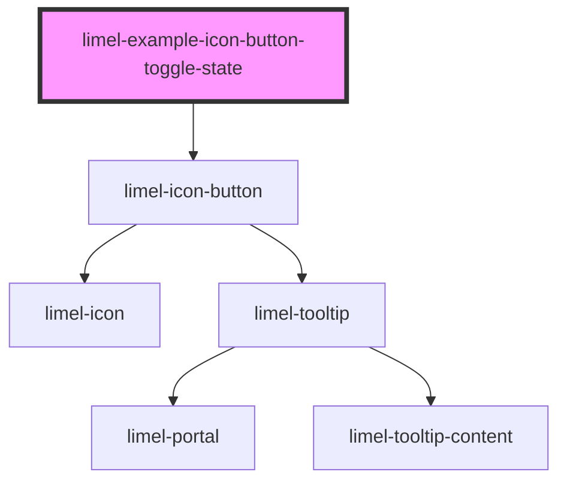

<!-- Auto Generated Below -->

## Overview

Toggle State

This isn't really a feature of `limel-icon-button`, but since it is a common
use case, here is a simple way to make the icon button toggle between two
different "states", each with its own icon and label.

## Dependencies

### Depends on

- [limel-icon-button](..)

### Graph

----------------------------------------------

*Built with [StencilJS](https://stenciljs.com/)*
