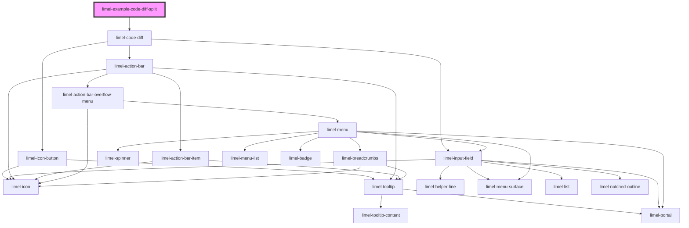

<!-- Auto Generated Below -->

## Overview

Split (side-by-side) view

Set `layout` to `split` for a side-by-side comparison.
The old version is shown on the left, the new version on the right.
Paired changes are aligned on the same row, making it easy
to see exactly what changed.

## Dependencies

### Depends on

- [limel-code-diff](..)

### Graph

----------------------------------------------

*Built with [StencilJS](https://stenciljs.com/)*
