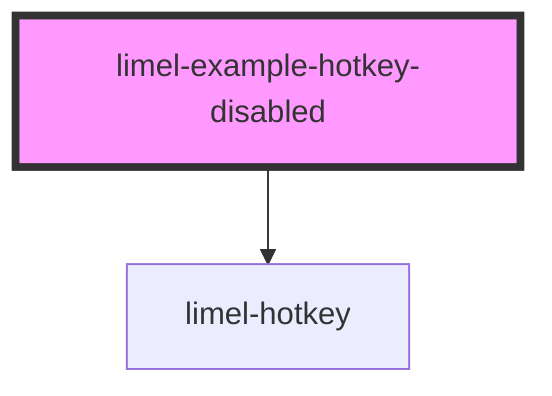

<!-- Auto Generated Below -->

## Overview

The `disabled` prop

When set to `true`, the hotkey is rendered in a visually disabled state.
This is useful when the action associated with the hotkey is temporarily
unavailable (e.g. a disabled menu item).

## Dependencies

### Depends on

- [limel-hotkey](..)

### Graph

----------------------------------------------

*Built with [StencilJS](https://stenciljs.com/)*
