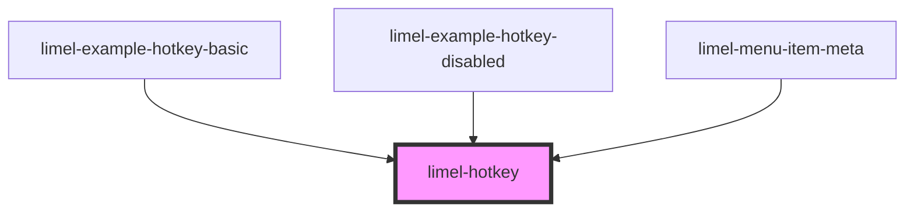

<!-- Auto Generated Below -->

## Overview

This is a display-only component used to visualize keyboard shortcuts.
It renders hotkey strings as styled `<kbd>` elements with
platform-aware glyphs (e.g. `⌘` on macOS, `⊞ Win` on Windows).

It does **not** listen for or handle any keyboard events.
Keyboard event handling is the responsibility of the parent component
(e.g. `limel-menu` or `limel-select`).

## Properties

| Property   | Attribute  | Description                                                         | Type      | Default     |
| ---------- | ---------- | ------------------------------------------------------------------- | --------- | ----------- |
| `disabled` | `disabled` | When `true`, the hotkey is rendered in a visually disabled state.   | `boolean` | `false`     |
| `value`    | `value`    | The hotkey string to visualize, e.g. `"meta+c"` or `"shift+enter"`. | `string`  | `undefined` |

## Dependencies

### Used by

 - [limel-example-hotkey-basic](examples)
 - [limel-example-hotkey-disabled](examples)
 - [limel-menu-item-meta](../list-item/menu-item-meta)

### Graph

----------------------------------------------

*Built with [StencilJS](https://stenciljs.com/)*
