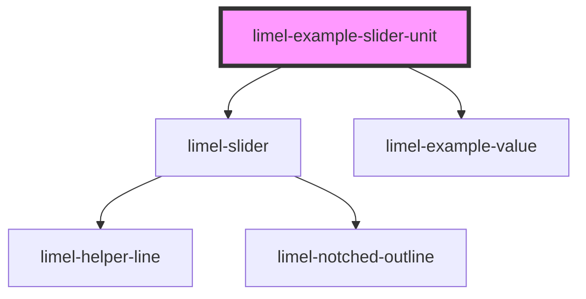

<!-- Auto Generated Below -->

## Overview

Using the `unit` prop

The `unit` prop lets you display a measurement unit alongside the
slider's min, max, and current value indicators. This gives users
immediate context about what the number represents, without needing
to read surrounding labels or descriptions.

For example, a slider controlling temperature becomes much clearer
when the value reads `22°C` instead of just `22`.

## Dependencies

### Depends on

- [limel-slider](..)
- [limel-example-value](../../../examples)

### Graph

----------------------------------------------

*Built with [StencilJS](https://stenciljs.com/)*
